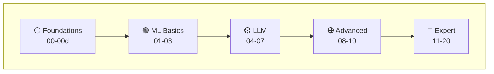

# AI for the Win

### Build AI-Powered Security Tools | From Zero to Production

[](https://github.com/depalmar/ai_for_the_win/actions/workflows/ci.yml)
[](https://github.com/depalmar/ai_for_the_win/actions/workflows/ci.yml)
[](https://www.python.org/downloads/)
[](https://opensource.org/licenses/MIT)
[](https://colab.research.google.com/github/depalmar/ai_for_the_win/blob/main/notebooks/lab01_phishing_classifier.ipynb)
[](./Dockerfile)

A hands-on training program for security practitioners who want to build AI-powered tools for threat detection, incident response, and security automation. **25 labs** (including 5 intro labs), **4 capstone projects**, **15 CTF challenges**. Includes **sample datasets** and **solution walkthroughs**. Designed for **vibe coding** with AI assistants like Cursor, Claude Code, and Copilot.

---

## Get Started in 5 Minutes

### Option 1: Zero Setup (Google Colab)

No installation needed — run labs directly in your browser:

[](https://colab.research.google.com/github/depalmar/ai_for_the_win/blob/main/notebooks/lab01_phishing_classifier.ipynb) [](https://colab.research.google.com/github/depalmar/ai_for_the_win/blob/main/notebooks/lab04_llm_log_analysis.ipynb)

> All notebooks are in the [`notebooks/`](./notebooks/) folder — open any `.ipynb` file in Colab.

### Option 2: Local Setup

```bash
# 1. Clone the repository
git clone https://github.com/depalmar/ai_for_the_win.git
cd ai_for_the_win

# 2. Install Python dependencies
python -m venv venv
source venv/bin/activate  # On Windows: .\venv\Scripts\activate
pip install -r requirements.txt

# 3. Start with Lab 00 (environment setup) - NO API KEY NEEDED!
cd labs/lab00-environment-setup
cat README.md  # Read the lab instructions

# 4. Work through intro labs: 00a → 00b → 00c → 00d → 01
# Or jump straight to Lab 01 if you know Python/ML basics
cd ../lab01-phishing-classifier
python solution/main.py
```

### Ready for LLM-Powered Labs? (Labs 04+)

```bash
# Configure API key (choose ONE provider)
cp .env.example .env
echo "ANTHROPIC_API_KEY=your-key-here" >> .env  # Get from console.anthropic.com
# OR use OpenAI/Google - see .env.example for all options

# Verify your setup
python scripts/verify_setup.py

# Run your first LLM lab
cd labs/lab04-llm-log-analysis
python solution/main.py
```

> 📖 **New to Python or ML?** Start with Labs 00a-00b-01-02-03 (no API keys required!)
> 📖 **Know ML, want LLMs?** Jump to Lab 04 and get an API key first
> 📖 **Need help?** Read [GETTING_STARTED.md](./GETTING_STARTED.md) for detailed setup
> 📖 **Lost in the docs?** See [DOCUMENTATION_GUIDE.md](./DOCUMENTATION_GUIDE.md) for navigation

---

## What It Looks Like

<!-- TODO: Add screenshots. See docs/assets/README.md for guidance -->

**Lab 01 - Phishing Classifier** catches what rules miss:

```
$ python labs/lab01-phishing-classifier/solution/main.py

[+] Trained on 1,000 labeled emails
[+] Model: Random Forest with TF-IDF features

Testing on new emails...
  "Dear user, your account will be suspended" → 🚨 PHISHING (94%)
  "Q3 revenue report attached"               → ✅ LEGIT (91%)
  "Coinbase: verify identity immediately"    → 🚨 PHISHING (97%)

Top phishing indicators learned:
  1. urgency_score    (+0.34)  ← "immediately", "suspend", "verify"
  2. url_mismatch     (+0.28)  ← display text ≠ actual link
  3. sender_anomaly   (+0.19)  ← domain doesn't match brand
```

**Lab 04 - LLM Log Analysis** finds attacks in noise:

```
$ python labs/lab04-llm-log-analysis/solution/main.py

[1/3] Pre-filtering 10,000 auth events...
[2/3] Found 23 anomalous patterns → sending to Claude
[3/3] AI analysis complete

🔴 ATTACK CHAIN DETECTED

  Stage 1: Credential Stuffing
    Source: 45.33.32.156 (Tor exit node)
    847 failed logins → 12 accounts compromised
    ⚠️  All 12 had MFA disabled
    → MITRE ATT&CK: T1110.004

  Stage 2: Lateral Movement (15 min later)
    'svc_backup' → SMB to FILE01, FILE02, DC01
    ⚠️  Includes domain controller
    → MITRE ATT&CK: T1021.002 (SMB/Windows Admin Shares)

  Timeline: 02:14 initial access → 02:29 lateral spread

Action: Isolate FILE01/FILE02/DC01, reset 12 accounts, enforce MFA
```

---

## Interactive Lab Navigator

**Click any lab to explore** — Your learning journey from setup to expert:



<table>
<tr>
<td align="center"><a href="./labs/lab00-environment-setup/"></a></td>
<td align="center"><a href="./labs/lab00a-python-security-fundamentals/"></a></td>
<td align="center"><a href="./labs/lab00b-ml-concepts-primer/"></a></td>
<td align="center"><a href="./labs/lab00c-intro-prompt-engineering/"></a></td>
<td align="center"><a href="./labs/lab00d-ai-in-security-operations/"></a></td>
</tr>
<tr>
<td align="center"><a href="./labs/lab01-phishing-classifier/"></a></td>
<td align="center"><a href="./labs/lab02-malware-clustering/"></a></td>
<td align="center"><a href="./labs/lab03-anomaly-detection/"></a></td>
<td align="center"><a href="./labs/lab04-llm-log-analysis/"></a></td>
<td align="center"><a href="./labs/lab05-threat-intel-agent/"></a></td>
</tr>
<tr>
<td align="center"><a href="./labs/lab06-security-rag/"></a></td>
<td align="center"><a href="./labs/lab07-yara-generator/"></a></td>
<td align="center"><a href="./labs/lab08-vuln-prioritizer/"></a></td>
<td align="center"><a href="./labs/lab09-detection-pipeline/"></a></td>
<td align="center"><a href="./labs/lab10-ir-copilot/"></a></td>
</tr>
<tr>
<td align="center"><a href="./labs/lab11-ransomware-detection/"></a></td>
<td align="center"><a href="./labs/lab12-ransomware-simulation/"></a></td>
<td align="center"><a href="./labs/lab13-memory-forensics-ai/"></a></td>
<td align="center"><a href="./labs/lab14-c2-traffic-analysis/"></a></td>
<td align="center"><a href="./labs/lab15-lateral-movement-detection/"></a></td>
</tr>
<tr>
<td align="center"><a href="./labs/lab16-threat-actor-profiling/"></a></td>
<td align="center"><a href="./labs/lab17-adversarial-ml/"></a></td>
<td align="center"><a href="./labs/lab18-fine-tuning-security/"></a></td>
<td align="center"><a href="./labs/lab19-cloud-security-ai/"></a></td>
<td align="center"><a href="./labs/lab20-llm-red-teaming/"></a></td>
</tr>
<tr>
<td align="center" colspan="5"><strong>Legend:</strong> ⚪ Intro (Free) | 🟢 ML (Free) | 🟡 LLM | 🟠 Advanced | 🔴 Expert DFIR</td>
</tr>
</table>

---

## Learning Paths

### Recommended Paths by Background

| Your Background                                | Start Here | Learning Path                                                                                      |
| ---------------------------------------------- | ---------- | -------------------------------------------------------------------------------------------------- |
| **Complete beginner** (no Python)              | Lab 00a    | 00a (Python) → 00b (ML theory) → 01 (ML hands-on) → 02 → 03 → 04 (LLMs) → 00c (advanced prompting) |
| **Know Python**, new to ML                     | Lab 00b    | 00b (ML theory) → 01 → 02 → 03 (ML foundations) → 04 → 06 → 05 (LLM/agents)                        |
| **Know Python & ML**, new to LLMs              | Lab 04     | 04 (basic prompting) → 06 (RAG) → 05 (agents) → 00c (advanced prompting) → 07-10                   |
| **Want to build AI agents**                    | Lab 04     | 04 (prompting) → 05 (ReAct agents) → 06 (RAG) → 10 (copilot) → Capstone                            |
| **DFIR/SOC analyst**                           | Lab 01     | 01 → 03 (ML detection) → 04 (log analysis) → 11 (ransomware) → 13 (memory forensics)               |
| **Red Team/Offensive**                         | Lab 03     | 03 (anomaly det) → 12 (purple team) → 14 (C2) → 15 (lateral movement) → 17 (adversarial ML)        |
| **Threat Intel analyst**                       | Lab 04     | 04 (log analysis) → 05 (threat intel agent) → 06 (RAG) → 14 (C2) → 16 (actor profiling)            |
| **Security engineer** (build production tools) | Lab 01     | 01 → 03 → 04 → 08 (vuln scanner) → 09 (pipeline) → 10 (IR copilot) → Capstone                      |

**💡 Pro Tip**: Labs 01-03 require NO API keys - perfect for learning ML foundations cost-free! Get comfortable with ML before moving to LLM-powered labs (04+).

---

## What You'll Build

### Labs Overview

| Lab     | Project                         | What You'll Learn                                                                                         |
| ------- | ------------------------------- | --------------------------------------------------------------------------------------------------------- |
| **00a** | **Python for Security**         | Variables, files, APIs, regex, security-focused Python basics                                             |
| **00b** | **ML Concepts Primer**          | Supervised/unsupervised learning, features, training, evaluation metrics                                  |
| **00c** | **Intro to Prompt Engineering** | LLM basics with free playgrounds, prompting fundamentals, hallucination detection, security templates     |
| **00d** | **AI in Security Operations**   | Where AI fits in SOC, human-in-the-loop, AI as attack surface, compliance considerations                  |
| **01**  | **Phishing Classifier**         | Text preprocessing, TF-IDF vectorization, Random Forest classification, model evaluation metrics          |
| **02**  | **Malware Clusterer**           | Feature extraction from binaries, K-Means & DBSCAN clustering, dimensionality reduction, cluster analysis |
| **03**  | **Anomaly Detector**            | Statistical baselines, Isolation Forest, Local Outlier Factor, threshold optimization for security        |
| **04**  | **Log Analyzer**                | Prompt engineering for security, structured output parsing, IOC extraction, LLM-powered analysis          |
| **05**  | **Threat Intel Agent**          | ReAct pattern implementation, tool use with LangChain, autonomous investigation workflows                 |
| **06**  | **Security RAG**                | Document chunking, vector embeddings, ChromaDB, retrieval-augmented generation for Q&A                    |
| **07**  | **YARA Generator**              | Static malware analysis, pattern extraction, AI-assisted rule generation, rule validation                 |
| **08**  | **Vuln Prioritizer**            | CVSS scoring, risk-based prioritization, remediation planning with LLMs                                   |
| **09**  | **Detection Pipeline**          | Multi-stage architectures, ML filtering, LLM enrichment, alert correlation                                |
| **10**  | **IR Copilot**                  | Conversational agents, state management, playbook execution, incident documentation                       |
| **11**  | **Ransomware Detector**         | Entropy analysis, behavioral detection, ransom note IOC extraction, response automation                   |
| **12**  | **Purple Team Sim**             | Safe adversary emulation, detection validation, gap analysis, purple team exercises                       |
| **13**  | **Memory Forensics AI**         | Volatility3 integration, process injection detection, credential dumping, LLM artifact analysis           |
| **14**  | **C2 Traffic Analysis**         | Beaconing detection, DNS tunneling, encrypted C2, JA3 fingerprinting, traffic classification              |
| **15**  | **Lateral Movement Detection**  | Auth anomaly detection, remote execution (PsExec/WMI/WinRM), graph-based attack paths                     |
| **16**  | **Threat Actor Profiling**      | TTP extraction, campaign clustering, malware attribution, actor profile generation                        |
| **17**  | **Adversarial ML**              | Evasion attacks, poisoning attacks, adversarial training, robust ML defenses                              |
| **18**  | **Fine-Tuning for Security**    | Custom embeddings, LoRA fine-tuning, security-specific models, deployment                                 |
| **19**  | **Cloud Security AI**           | AWS/Azure/GCP security, CloudTrail analysis, multi-cloud threat detection                                 |
| **20**  | **LLM Red Teaming**             | Prompt injection, jailbreaking defenses, guardrails, LLM security testing                                 |

### Skills Progression

```
┌────────────────────────────────────────────────────────────────────────────────────────────────┐
│  INTRO          │  ML FOUNDATIONS   │  LLM BASICS        │  ADVANCED LLM      │  EXPERT         │
│  Labs 00a-00c   │  Labs 01-03       │  Labs 04-07        │  Labs 08-10        │  Labs 11-20     │
├─────────────────┼───────────────────┼────────────────────┼────────────────────┼────────────────┤
│  • Python       │  • Supervised ML  │  • Prompt Eng      │  • System Design   │  • DFIR         │
│  • ML Theory    │  • Unsupervised   │  • AI Agents       │  • ML+LLM Hybrid   │  • Forensics    │
│  • Prompting    │  • Feature Eng    │  • RAG Systems     │  • Pipelines       │  • C2 Detect    │
│  (optional)     │  • Evaluation     │  • Code Gen        │  • Production      │  • Attribution  │
│                 │                   │                    │                    │  • Adv ML       │
│                 │                   │                    │                    │  • LLM Red Team │
│  💰 FREE        │  💰 FREE          │  💰 ~$2-8 API      │  💰 ~$5-15 API     │  💰 ~$10-25    │
└────────────────────────────────────────────────────────────────────────────────────────────────┘

💡 **Cost-Saving Tip**: Complete Labs 01-03 first (FREE, no API keys) to build ML foundations before
   investing in LLM API credits. Then use free tiers: Anthropic ($5 free), Google AI Studio (free),
   OpenAI ($5 free for new accounts). Costs based on 2025 pricing: Claude 3.5 Sonnet ($3/$15 per 1M
   tokens), GPT-4o ($5/$20 per 1M), Gemini 2.5 Pro ($1.25/$10 per 1M).
```

### When to Use ML vs LLM

| Security Task          | Best Approach | Why                                        |
| ---------------------- | ------------- | ------------------------------------------ |
| Malware classification | **ML**        | Fast, interpretable, structured features   |
| Log anomaly detection  | **ML**        | High volume, real-time capable             |
| Threat report analysis | **LLM**       | Natural language understanding             |
| IOC extraction         | **LLM**       | Flexible parsing of unstructured text      |
| Phishing detection     | **Hybrid**    | ML for volume, LLM for sophisticated cases |
| Detection pipeline     | **Hybrid**    | ML filters 90%, LLM analyzes 10%           |

> 📖 **Full comparison**: See [ML vs LLM Decision Framework](./LEARNING_GUIDE.md#choosing-the-right-tool-ml-vs-llm) for detailed guidance, cost analysis, and hybrid architecture patterns.

---

## Repository Structure

```
ai_for_the_win/
├── labs/                          # 25 hands-on labs
│   ├── lab00-environment-setup/  # Setup guide for beginners
│   ├── lab00a-python-security-fundamentals/ # Python basics for security
│   ├── lab00b-ml-concepts-primer/ # ML theory before coding
│   ├── lab00c-intro-prompt-engineering/ # Prompt design & basics
│   ├── lab00d-ai-in-security-operations/ # AI in SOC workflows
│   ├── lab01-phishing-classifier/ # ML text classification
│   ├── lab02-malware-clustering/  # Unsupervised learning
│   ├── lab03-anomaly-detection/   # Network security
│   ├── lab04-llm-log-analysis/    # Prompt engineering
│   ├── lab05-threat-intel-agent/  # ReAct agents
│   ├── lab06-security-rag/        # Vector search + LLM
│   ├── lab07-yara-generator/      # AI code generation
│   ├── lab08-vuln-scanner-ai/     # Risk prioritization
│   ├── lab09-detection-pipeline/  # Multi-stage ML+LLM
│   ├── lab10-ir-copilot/          # Conversational IR
│   ├── lab11-ransomware-detection/# DFIR + behavioral analysis
│   ├── lab12-ransomware-simulation/# Purple team exercises
│   ├── lab13-memory-forensics-ai/ # Memory forensics with AI
│   ├── lab14-c2-traffic-analysis/ # C2 detection & analysis
│   ├── lab15-lateral-movement-detection/ # Attack path detection
│   ├── lab16-threat-actor-profiling/ # Attribution & profiling
│   ├── lab17-adversarial-ml/     # Evasion & poisoning attacks
│   ├── lab18-fine-tuning/        # Custom security models
│   ├── lab19-cloud-security/     # Multi-cloud threat detection
│   └── lab20-llm-red-teaming/    # LLM security testing
├── notebooks/                     # Jupyter notebooks (Colab-ready)
├── capstone-projects/             # 4 comprehensive projects
├── templates/                     # Reusable code templates
│   ├── agents/                    # LangChain agent templates
│   ├── prompts/                   # Security prompt library
│   ├── visualizations/            # Dashboards & diagrams
│   └── reports/                   # Report generators
├── resources/                     # Tools, datasets, MCP servers guide
├── setup/                         # Environment setup guides
│   └── guides/                    # Troubleshooting & error handling
├── tests/                         # Comprehensive test suite
├── Dockerfile                     # Multi-stage Docker build
└── docker-compose.yml             # Dev, test, notebook services
```

---

## Lab Progress Tracker

Track your progress through the labs:

**Intro (Recommended)**

- [ ] **Lab 00**: Environment Setup (Python, VS Code, virtual env)
- [ ] **Lab 00a**: Python for Security Fundamentals
- [ ] **Lab 00b**: ML Concepts Primer
- [ ] **Lab 00c**: Intro to Prompt Engineering
- [ ] **Lab 00d**: AI in Security Operations (conceptual)

**Core Labs**

- [ ] **Lab 01**: Phishing Email Classifier
- [ ] **Lab 02**: Malware Sample Clustering
- [ ] **Lab 03**: Network Anomaly Detection
- [ ] **Lab 04**: LLM-Powered Log Analysis
- [ ] **Lab 05**: Threat Intelligence Agent
- [ ] **Lab 06**: Security RAG System
- [ ] **Lab 07**: AI YARA Rule Generator
- [ ] **Lab 08**: Vulnerability Scanner AI
- [ ] **Lab 09**: Threat Detection Pipeline
- [ ] **Lab 10**: IR Copilot Agent
- [ ] **Lab 11**: Ransomware Detection & Response
- [ ] **Lab 12**: Ransomware Simulation (Purple Team)
- [ ] **Lab 13**: Memory Forensics AI
- [ ] **Lab 14**: C2 Traffic Analysis
- [ ] **Lab 15**: Lateral Movement Detection
- [ ] **Lab 16**: Threat Actor Profiling
- [ ] **Lab 17**: Adversarial ML
- [ ] **Lab 18**: Fine-tuning Security
- [ ] **Lab 19**: Cloud Security AI
- [ ] **Lab 20**: LLM Red Teaming
- [ ] **Capstone**: Complete one capstone project

---

## Technology Stack

| Category           | Tools                                            |
| ------------------ | ------------------------------------------------ |
| **LLM Providers**  | Claude, GPT-4, Gemini, Ollama (local)            |
| **LLM Frameworks** | LangChain, LangGraph, LiteLLM, Instructor        |
| **ML/AI**          | scikit-learn, PyTorch, Hugging Face Transformers |
| **Vector DB**      | ChromaDB, sentence-transformers                  |
| **Security**       | YARA, Sigma, MITRE ATT&CK, pefile                |
| **Web/UI**         | FastAPI, Gradio, Streamlit                       |
| **Vibe Coding**    | Cursor, Claude Code, GitHub Copilot, Windsurf    |
| **Development**    | Python 3.10+, pytest, Docker, GitHub Actions     |

---

## Capstone Projects

Choose one to demonstrate mastery:

| Project                          | Difficulty   | Focus                     |
| -------------------------------- | ------------ | ------------------------- |
| **Security Analyst Copilot**     | Advanced     | LLM agents, IR automation |
| **Automated Threat Hunter**      | Advanced     | ML detection, pipelines   |
| **Malware Analysis Assistant**   | Intermediate | Static analysis, YARA     |
| **Vulnerability Intel Platform** | Intermediate | RAG, prioritization       |

Each project includes starter code, requirements, and evaluation criteria.

---

## Templates & Integrations

Jumpstart your projects with ready-to-use templates:

- **Agent Templates**: LangChain security agent, RAG agent
- **n8n Workflows**: IOC enrichment, alert triage with AI
- **SIEM Integrations**: Cortex XSIAM, Splunk, Elasticsearch, Microsoft Sentinel
- **Prompt Library**: Log analysis, threat detection, report generation

---

## Development

### Test Status

**Current Status**: 839/839 tests passing (100%) ✅

All 20 labs have comprehensive test coverage!

| Lab    | Tests | Status  | Focus Area                         |
| ------ | ----- | ------- | ---------------------------------- |
| Lab 01 | 14/14 | ✅ 100% | Phishing Classifier (ML)           |
| Lab 02 | 9/9   | ✅ 100% | Malware Clustering (ML)            |
| Lab 03 | 11/11 | ✅ 100% | Anomaly Detection (ML)             |
| Lab 04 | 18/18 | ✅ 100% | Log Analysis (LLM)                 |
| Lab 05 | 21/21 | ✅ 100% | Threat Intel Agent (LangChain)     |
| Lab 06 | 7/7   | ✅ 100% | Security RAG (Vector DB)           |
| Lab 07 | 8/8   | ✅ 100% | YARA Generator (Code Gen)          |
| Lab 08 | 11/11 | ✅ 100% | Vuln Scanner (Risk Prioritization) |
| Lab 09 | 15/15 | ✅ 100% | Detection Pipeline (Multi-stage)   |
| Lab 10 | 28/28 | ✅ 100% | IR Copilot (Conversational)        |
| Lab 11 | 37/37 | ✅ 100% | Ransomware Detection (DFIR)        |
| Lab 12 | 44/44 | ✅ 100% | Purple Team Sim (Safe Emulation)   |
| Lab 13 | 71/71 | ✅ 100% | Memory Forensics AI                |
| Lab 14 | 85/85 | ✅ 100% | C2 Traffic Analysis                |
| Lab 15 | 69/69 | ✅ 100% | Lateral Movement Detection         |
| Lab 16 | 90/90 | ✅ 100% | Threat Actor Profiling             |
| Lab 17 | 73/73 | ✅ 100% | Adversarial ML                     |
| Lab 18 | 76/76 | ✅ 100% | Fine-Tuning for Security           |
| Lab 19 | 64/64 | ✅ 100% | Cloud Security AI                  |
| Lab 20 | 88/88 | ✅ 100% | LLM Red Teaming                    |

**API Requirements**: Labs 04-20 require at least one LLM provider API key (`ANTHROPIC_API_KEY`, `OPENAI_API_KEY`, or `GOOGLE_API_KEY`). Labs 01-03 work without API keys.

### Running Tests

```bash
# Run all tests
pytest tests/ -v

# Run specific lab tests
pytest tests/test_lab01_phishing_classifier.py -v

# Run with coverage
pytest tests/ --cov=labs --cov-report=html

# Run in Docker
docker-compose run test
```

### Code Quality

```bash
# Format code
black .
isort .

# Lint
flake8 .

# Security scan
bandit -r labs/
```

### Environment Variables

Copy `.env.example` to `.env` and configure:

| Variable             | Description       | Required                |
| -------------------- | ----------------- | ----------------------- |
| `ANTHROPIC_API_KEY`  | Claude API key    | One LLM key required    |
| `OPENAI_API_KEY`     | OpenAI GPT-4 key  | One LLM key required    |
| `GOOGLE_API_KEY`     | Google Gemini key | One LLM key required    |
| `VIRUSTOTAL_API_KEY` | VirusTotal API    | Optional (threat intel) |
| `ABUSEIPDB_API_KEY`  | AbuseIPDB API     | Optional (threat intel) |

> **Note:** You only need ONE LLM provider key. All labs support multiple providers.

---

## Getting Help

- **New to this?**: Start with [Lab 00: Environment Setup](./labs/lab00-environment-setup/)
- **Find your path**: See [Role-Based Learning Paths](./resources/role-based-learning-paths.md) for SOC, IR, hunting, etc.
- **Confused by AI terms?**: Check the [Security-to-AI Glossary](./resources/security-to-ai-glossary.md)
- **API Keys**: See the [API Keys Guide](./setup/guides/api-keys-guide.md) for setup and cost management
- **Jupyter Notebooks**: Check the [Jupyter Basics Guide](./setup/guides/jupyter-basics-guide.md)
- **Troubleshooting**: Check the [troubleshooting guide](./setup/guides/troubleshooting-guide.md)
- **Error Handling**: See [error handling best practices](./setup/guides/error-handling-guide.md)
- **Documentation**: Browse [setup guides](./setup/) and [resources](./resources/)
- **Issues**: Open a [GitHub issue](https://github.com/depalmar/ai_for_the_win/issues)

---

## Quick Links

| Resource                                                              | Description                                         |
| --------------------------------------------------------------------- | --------------------------------------------------- |
| [Environment Setup](./labs/lab00-environment-setup/)                  | First-time setup for beginners                      |
| [Role-Based Learning Paths](./resources/role-based-learning-paths.md) | Paths for SOC, IR, hunting, red team                |
| [Security-to-AI Glossary](./resources/security-to-ai-glossary.md)     | AI terms explained for security folks               |
| [API Keys Guide](./setup/guides/api-keys-guide.md)                    | Get API keys, manage costs                          |
| [Quick Start](./QUICKSTART.md)                                        | Get running fast                                    |
| [Documentation Guide](./DOCUMENTATION_GUIDE.md)                       | Find exactly what you need                          |
| [Security Prompts](./resources/prompt-library/security-prompts.md)    | Ready-to-use prompts for security tasks             |
| [Lab Walkthroughs](./docs/walkthroughs/)                              | Step-by-step solutions when stuck                   |
| [Cheatsheets](./resources/cheatsheets/)                               | Quick references for Claude Code, Cursor, LangChain |
| [SIEM Integrations](./resources/integrations/)                        | Splunk, Elastic, XSIAM integration guides           |
| [Tools & APIs](./resources/tools-and-resources.md)                    | 80+ security tools, APIs, datasets                  |
| [MCP Servers](./resources/mcp-servers-security-guide.md)              | MCP servers for DFIR, threat intel                  |

---

## Contributing

Contributions welcome! Please read [CONTRIBUTING.md](./CONTRIBUTING.md) before submitting PRs.

Ways to contribute:

- Fix bugs or improve existing labs
- Add new sample data or test cases
- Improve documentation
- Share your capstone projects

---

## License

This project is licensed under the MIT License - see the [LICENSE](./LICENSE) file for details.

---

## Disclaimer

This training material is intended for **educational purposes** and **authorized security testing only**. Users are responsible for ensuring compliance with all applicable laws and obtaining proper authorization before using any offensive techniques.

---

<p align="center">
  <b>Ready to build AI-powered security tools?</b><br>
  <a href="./labs/lab00-environment-setup/">Get Started</a> |
  <a href="./curriculum/ai-security-training-program.md">View Full Curriculum</a>
</p>
