<p align="center">
  
</p>

# AI for the Win

### Build AI-Powered Security Tools | Hands-On Learning

[](https://github.com/depalmar/ai_for_the_win/actions/workflows/ci.yml)
[](https://github.com/depalmar/ai_for_the_win/actions/workflows/ci.yml)
[](https://www.python.org/downloads/)
[](https://opensource.org/licenses/MIT)
[](https://colab.research.google.com/github/depalmar/ai_for_the_win/blob/main/notebooks/lab01_phishing_classifier.ipynb)
[](./Dockerfile)

> **Disclaimer**: This is a personal educational project created and maintained on personal time. It is not affiliated with, endorsed by, or sponsored by any employer, organization, or vendor. All tool and platform references are for educational purposes only and do not constitute endorsement or recommendation. The author's views are their own.

A hands-on training program for security practitioners who want to build AI-powered tools for threat detection, incident response, and security automation. **30+ labs** (including 8 intro labs and 10 bridge labs), **4 capstone projects**, **15 CTF challenges**. Includes **sample datasets** and **solution walkthroughs**. Designed for **vibe coding** with AI assistants like Cursor, Claude Code, and Copilot.

---

## Get Started in 5 Minutes

### Option 1: Zero Setup (Google Colab)

No installation needed — run labs directly in your browser:

[](https://colab.research.google.com/github/depalmar/ai_for_the_win/blob/main/notebooks/lab01_phishing_classifier.ipynb) [](https://colab.research.google.com/github/depalmar/ai_for_the_win/blob/main/notebooks/lab04_llm_log_analysis.ipynb)

> All notebooks are in the [`notebooks/`](./notebooks/) folder — open any `.ipynb` file in Colab.

### Option 2: Local Setup

```bash
# 1. Clone the repository
git clone https://github.com/depalmar/ai_for_the_win.git
cd ai_for_the_win

# 2. Install Python dependencies
python -m venv venv
source venv/bin/activate  # On Windows: .\venv\Scripts\activate
pip install -r requirements.txt

# 3. Start with Lab 00 (environment setup) - NO API KEY NEEDED!
cd labs/lab00-environment-setup
cat README.md  # Read the lab instructions

# 4. Work through intro labs: 00a → 00b → 00c → 00d → 01
# Or jump straight to Lab 01 if you know Python/ML basics
cd ../lab01-phishing-classifier
python solution/main.py
```

### Ready for LLM-Powered Labs? (Labs 04+)

```bash
# Configure API key (choose ONE provider)
cp .env.example .env
echo "ANTHROPIC_API_KEY=your-key-here" >> .env  # Get from console.anthropic.com
# OR use OpenAI/Google - see .env.example for all options

# Verify your setup
python scripts/verify_setup.py

# Run your first LLM lab
cd labs/lab04-llm-log-analysis
python solution/main.py
```

> 📖 **New to Python or ML?** Start with Labs 00a-00b-01-02-03 (no API keys required!)
> 📖 **Know ML, want LLMs?** Jump to Lab 04 and get an API key first
> 📖 **Need help?** Read [GETTING_STARTED.md](./docs/GETTING_STARTED.md) for detailed setup
> 📖 **Lost in the docs?** See [Documentation Guide](./docs/documentation-guide.md) for navigation

---

## What It Looks Like

### The AI Defense Pipeline

This architecture (from **Lab 09**) shows how we combine cheap, fast ML models with smart, reasoning LLMs:

```mermaid
flowchart LR
    %% Nodes
    Input[("🔍 Logs & Events")]

    subgraph ML ["🟢 Layer 1: ML Filter (Fast & Cheap)"]
        direction TB
        Model1["Phishing Classifier (Lab 01)"]
        Model2["Anomaly Detector (Lab 03)"]
    end

    subgraph LLM ["🟣 Layer 2: AI Analysis (Reasoning)"]
        direction TB
        Analyst["Log Analyst (Lab 04)"]
        Agent["Threat Intel Agent (Lab 05)"]
    end

    subgraph Action ["🟠 Layer 3: Response"]
        Alert["🚨 High Fidelity Alert"]
        Report["📋 Incident Report"]
    end

    %% Edges
    Input --> ML
    ML -- "Clear Benign (99%)" --> Discard((Discard))
    ML -- "Suspicious" --> LLM
    LLM --> Agent
    Agent --> Alert & Report

    %% Styling
    classDef default fill:#1e293b,stroke:#334155,color:#fff;
    classDef cluster fill:#0f172a,stroke:#475569,color:#fff;
    classDef input fill:#0ea5e9,stroke:#0284c7,color:#fff;
```



**Lab 01 - Phishing Classifier** catches what rules miss:

```text
$ python labs/lab01-phishing-classifier/solution/main.py

[+] Training on 1,000 labeled emails...
[+] Model: Random Forest + TF-IDF (847 features)
[+] Accuracy: 96.2% | Precision: 94.1% | Recall: 97.8%

📬 Scanning inbox (4 new emails)...

  From: security@amaz0n-verify.com
  Subj: "Your account will be suspended in 24 hours"
  ──→ 🚨 PHISHING (98.2%)  [urgency + spoofed domain]

  From: sarah.jones@company.com
  Subj: "Q3 budget report attached"
  ──→ ✅ LEGIT (94.6%)

  From: helpdesk@paypa1.com
  Subj: "Click here to verify your identity"
  ──→ 🚨 PHISHING (96.7%)  [link mismatch + typosquat]

  From: it-dept@company.com
  Subj: "Password expires in 7 days - reset here"
  ──→ ⚠️  SUSPICIOUS (67.3%)  [needs review]

📊 Top features that caught phishing:
   urgency_words: +0.34  (suspend, verify, immediately)
   url_mismatch:  +0.28  (display ≠ actual link)
   domain_spoof:  +0.22  (amaz0n, paypa1)
```

**Lab 04 - LLM Log Analysis** finds attacks in noise:

```text
┌──────────────────────────────────────────────────────┐
│ Lab 04: LLM-Powered Security Log Analysis - SOLUTION │
└──────────────────────────────────────────────────────┘
Security Log Analysis Pipeline

Step 1: Initializing LLM...
  LLM initialized: READY
Step 2: Parsing log entries...
  Parsing entry 1/5...
  Parsing entry 2/5...
  Parsing entry 3/5...
  Parsing entry 4/5...
  Parsing entry 5/5...
  Parsed 5 log entries
Step 3: Analyzing for threats...
  Found 2 threats
  Severity: 8/10
Step 4: Extracting IOCs...
  Extracted 12 IOCs
Step 5: Generating incident report...
  Report generated

============================================================
INCIDENT REPORT
============================================================

┌──────────────────────────────────────────────────────────────────────────────┐
│                           Security Incident Report                           │
└──────────────────────────────────────────────────────────────────────────────┘


                               Executive Summary

A critical security incident involving multi-stage attack behavior was detected
on WORKSTATION01 involving user 'jsmith'. The attack progression includes
initial PowerShell execution downloading a payload from a suspicious external
domain, followed by system discovery commands, and culminating in persistence
establishment via Registry Run keys and Scheduled Tasks. The presence of known
malicious domains and persistence mechanisms indicates a high-risk compromise
requiring immediate containment.


                                    Timeline

 1 2025-01-15 03:22:10 - PowerShell script block execution: Downloaded content
   from hxxp://evil-c2[.]com/payload.ps1 using Net.WebClient.
 2 2025-01-15 03:22:15 - Discovery commands executed (whoami, hostname,
   ipconfig) via cmd.exe.
 3 2025-01-15 03:22:18 - Network connection detected from powershell.exe to
   evil-c2[.]com (185[.]143[.]223[.]47) over port 443.
 4 2025-01-15 03:23:00 - Persistence established: reg.exe added malware.exe to
   HKCU Run keys.
 5 2025-01-15 03:25:00 - Persistence established: Scheduled Task SecurityUpdate
   created pointing to malware.exe.


                                Technical Analysis

The attacker utilized a "Living off the Land" strategy, leveraging built-in
Windows tools (PowerShell, cmd.exe, reg.exe) to evade initial detection.

 • Initial Access/Execution: A PowerShell download cradle (New-Object
   System.Net.WebClient) retrieved a remote script.
 • C2/Exfiltration: Encrypted traffic (port 443) was observed to evil-c2[.]com.
 • Persistence: Dual persistence mechanisms were created:
    • Registry: HKCU\Software\Microsoft\Windows\CurrentVersion\Run
    • Scheduled Task: \Microsoft\Windows\Maintenance\SecurityUpdate
      (Masquerading as a legitimate update task).


                                Attribution Analysis

High Confidence (Attributed to FIN7/Carbanak) based on:
 • Tooling: Use of modified `certutil` and `DNS-based C2` matches known campaigns.
 • Infrastructure: `evil-c2[.]com` has historical associations with FIN7 (Mock Intel).
 • TTP Overlap: The specific sequence of PowerShell obfuscation -> Registry Run Key
   is a signature behavior pattern.


                              MITRE ATT&CK Mapping


  Technique ID   Technique Name                  Evidence
 ──────────────────────────────────────────────────────────────────────────────
  T1059.001      Command and Scripting           powershell.exe,
                 Interpreter: PowerShell         DownloadString, IEX
  T1082          System Information Discovery    whoami, hostname, ipconfig
  T1547.001      Boot or Logon Autostart         reg add ...
                 Execution: Registry Run Keys    CurrentVersion\Run
  T1053.005      Scheduled Task/Job: Scheduled   TaskName: ...SecurityUpdate
                 Task
  T1105          Ingress Tool Transfer           DownloadString('hxxp://evil-…
```

---

## Interactive Lab Navigator

**Click any lab to explore** — Your learning journey from setup to expert:

<table>
<tr>
<td align="center"><a href="./labs/lab00-environment-setup/"></a></td>
<td align="center"><a href="./labs/lab00a-python-security-fundamentals/"></a></td>
<td align="center"><a href="./labs/lab00b-ml-concepts-primer/"></a></td>
<td align="center"><a href="./labs/lab00c-intro-prompt-engineering/"></a></td>
<td align="center"><a href="./labs/lab00d-ai-in-security-operations/"></a></td>
</tr>
<tr>
<td align="center"><a href="./labs/lab01-phishing-classifier/"></a></td>
<td align="center"><a href="./labs/lab02-malware-clustering/"></a></td>
<td align="center"><a href="./labs/lab03-anomaly-detection/"></a></td>
<td align="center"><a href="./labs/lab04-llm-log-analysis/"></a></td>
<td align="center"><a href="./labs/lab05-threat-intel-agent/"></a></td>
</tr>
<tr>
<td align="center"><a href="./labs/lab06-security-rag/"></a></td>
<td align="center"><a href="./labs/lab07-yara-generator/"></a></td>
<td align="center"><a href="./labs/lab08-vuln-scanner-ai/"></a></td>
<td align="center"><a href="./labs/lab09-detection-pipeline/"></a></td>
<td align="center"><a href="./labs/lab10-ir-copilot/"></a></td>
</tr>
<tr>
<td align="center"><a href="./labs/lab11-ransomware-detection/"></a></td>
<td align="center"><a href="./labs/lab12-ransomware-simulation/"></a></td>
<td align="center"><a href="./labs/lab13-memory-forensics-ai/"></a></td>
<td align="center"><a href="./labs/lab14-c2-traffic-analysis/"></a></td>
<td align="center"><a href="./labs/lab15-lateral-movement-detection/"></a></td>
</tr>
<tr>
<td align="center"><a href="./labs/lab16-threat-actor-profiling/"></a></td>
<td align="center"><a href="./labs/lab17-adversarial-ml/"></a></td>
<td align="center"><a href="./labs/lab18-fine-tuning-security/"></a></td>
<td align="center"><a href="./labs/lab19-cloud-security-ai/"></a></td>
<td align="center"><a href="./labs/lab20-llm-red-teaming/"></a></td>
</tr>
<tr>
<td align="center" colspan="5"><strong>Legend:</strong> ⚪ Intro (Free) | 🟢 ML (Free) | 🟡 LLM | 🟠 Advanced | 🔴 Expert DFIR</td>
</tr>
</table>

---

## Learning Paths

### Recommended Paths by Background

| Your Background                                | Start Here | Learning Path                                                                                      |
| ---------------------------------------------- | ---------- | -------------------------------------------------------------------------------------------------- |
| **Complete beginner** (no Python)              | Lab 00a    | 00a (Python) → 00b (ML theory) → 01 (ML hands-on) → 02 → 03 → 04 (LLMs) → 00c (advanced prompting) |
| **Know Python**, new to ML                     | Lab 00b    | 00b (ML theory) → 01 → 02 → 03 (ML foundations) → 04 → 06 → 05 (LLM/agents)                        |
| **Know Python & ML**, new to LLMs              | Lab 04     | 04 (basic prompting) → 06 (RAG) → 05 (agents) → 00c (advanced prompting) → 07-10                   |
| **Want to build AI agents**                    | Lab 04     | 04 (prompting) → 05 (ReAct agents) → 06 (RAG) → 10 (copilot) → Capstone                            |
| **AI Blue Team / SOC**                         | Lab 01     | 01 → 03 (ML detection) → 04 (log analysis) → 11 (ransomware) → 13 (memory forensics)               |
| **AI Red Team/Offensive**                      | Lab 03     | 03 (anomaly det) → 12 (purple team) → 14 (C2) → 15 (lateral movement) → 17 (adversarial ML)        |
| **Threat Intel analyst**                       | Lab 04     | 04 (log analysis) → 05 (threat intel agent) → 06 (RAG) → 14 (C2) → 16 (actor profiling)            |
| **Security engineer** (build production tools) | Lab 01     | 01 → 03 → 04 → 08 (vuln scanner) → 09 (pipeline) → 10 (IR copilot) → Capstone                      |

**💡 Pro Tip**: Labs 01-03 require NO API keys - perfect for learning ML foundations cost-free! Get comfortable with ML before moving to LLM-powered labs (04+).

---

## What You'll Build

### Labs Overview

| Lab     | Project                         | What You'll Learn                                                                                         |
| ------- | ------------------------------- | --------------------------------------------------------------------------------------------------------- |
| **00a** | **Python for Security**         | Variables, files, APIs, regex, security-focused Python basics                                             |
| **00b** | **ML Concepts Primer**          | Supervised/unsupervised learning, features, training, evaluation metrics                                  |
| **00c** | **Intro to Prompt Engineering** | LLM basics with free playgrounds, prompting fundamentals, hallucination detection, security templates     |
| **00d** | **AI in Security Operations**   | Where AI fits in SOC, human-in-the-loop, AI as attack surface, compliance considerations                  |
| **01**  | **Phishing Classifier**         | Text preprocessing, TF-IDF vectorization, Random Forest classification, model evaluation metrics          |
| **02**  | **Malware Clusterer**           | Feature extraction from binaries, K-Means & DBSCAN clustering, dimensionality reduction, cluster analysis |
| **03**  | **Anomaly Detector**            | Statistical baselines, Isolation Forest, Local Outlier Factor, threshold optimization for security        |
| **04**  | **Log Analyzer**                | Prompt engineering for security, structured output parsing, IOC extraction, LLM-powered analysis          |
| **05**  | **Threat Intel Agent**          | ReAct pattern implementation, tool use with LangChain, autonomous investigation workflows                 |
| **06**  | **Security RAG**                | Document chunking, vector embeddings, ChromaDB, retrieval-augmented generation for Q&A                    |
| **07**  | **YARA Generator**              | Static malware analysis, pattern extraction, AI-assisted rule generation, rule validation                 |
| **07b** | **Sigma Fundamentals**          | Sigma rule syntax, log-based detection, SIEM query conversion, LLM rule generation                        |
| **08**  | **Vuln Prioritizer**            | CVSS scoring, risk-based prioritization, remediation planning with LLMs                                   |
| **09**  | **Detection Pipeline**          | Multi-stage architectures, ML filtering, LLM enrichment, alert correlation                                |
| **10**  | **IR Copilot**                  | Conversational agents, state management, playbook execution, incident documentation                       |
| **11a** | **Ransomware Fundamentals**     | Ransomware evolution, families, attack lifecycle, indicators, recovery decisions                          |
| **11**  | **Ransomware Detector**         | Entropy analysis, behavioral detection, ransom note IOC extraction, response automation                   |
| **12**  | **Purple Team Sim**             | Safe adversary emulation, detection validation, gap analysis, purple team exercises                       |
| **13**  | **Memory Forensics AI**         | Volatility3 integration, process injection detection, credential dumping, LLM artifact analysis           |
| **14**  | **C2 Traffic Analysis**         | Beaconing detection, DNS tunneling, encrypted C2, JA3 fingerprinting, traffic classification              |
| **15**  | **Lateral Movement Detection**  | Auth anomaly detection, remote execution (PsExec/WMI/WinRM), graph-based attack paths                     |
| **16**  | **Threat Actor Profiling**      | TTP extraction, campaign clustering, malware attribution, actor profile generation                        |
| **17**  | **Adversarial ML**              | Evasion attacks, poisoning attacks, adversarial training, robust ML defenses                              |
| **18**  | **Fine-Tuning for Security**    | Custom embeddings, LoRA fine-tuning, security-specific models, deployment                                 |
| **19**  | **Cloud Security AI**           | AWS/Azure/GCP security, CloudTrail analysis, multi-cloud threat detection                                 |
| **20**  | **LLM Red Teaming**             | Prompt injection, jailbreaking defenses, guardrails, LLM security testing                                 |

### Skills Progression

```
┌────────────────────────────────────────────────────────────────────────────────────────────────┐
│  INTRO          │  ML FOUNDATIONS   │  LLM BASICS        │  ADVANCED LLM      │  EXPERT         │
│  Labs 00a-00c   │  Labs 01-03       │  Labs 04-07        │  Labs 08-10        │  Labs 11-20     │
├─────────────────┼───────────────────┼────────────────────┼────────────────────┼────────────────┤
│  • Python       │  • Supervised ML  │  • Prompt Eng      │  • System Design   │  • DFIR         │
│  • ML Theory    │  • Unsupervised   │  • AI Agents       │  • ML+LLM Hybrid   │  • Forensics    │
│  • Prompting    │  • Feature Eng    │  • RAG Systems     │  • Pipelines       │  • C2 Detect    │
│  (optional)     │  • Evaluation     │  • Code Gen        │  • Production      │  • Attribution  │
│                 │                   │                    │                    │  • Adv ML       │
│                 │                   │                    │                    │  • LLM Red Team │
│  💰 FREE        │  💰 FREE          │  💰 ~$2-8 API      │  💰 ~$5-15 API     │  💰 ~$10-25    │
└────────────────────────────────────────────────────────────────────────────────────────────────┘

💡 **Cost-Saving Tip**: Complete Labs 01-03 first (FREE, no API keys) to build ML foundations before
   investing in LLM API credits. Then use free tiers: Anthropic ($5 free), Google AI Studio (free),
   OpenAI ($5 free for new accounts). Costs based on 2025 pricing: Claude 3.5 Sonnet ($3/$15 per 1M
   tokens), GPT-4o ($5/$20 per 1M), Gemini 2.5 Pro ($1.25/$10 per 1M).
```

### When to Use ML vs LLM

| Security Task          | Best Approach | Why                                        |
| ---------------------- | ------------- | ------------------------------------------ |
| Malware classification | **ML**        | Fast, interpretable, structured features   |
| Log anomaly detection  | **ML**        | High volume, real-time capable             |
| Threat report analysis | **LLM**       | Natural language understanding             |
| IOC extraction         | **LLM**       | Flexible parsing of unstructured text      |
| Phishing detection     | **Hybrid**    | ML for volume, LLM for sophisticated cases |
| Detection pipeline     | **Hybrid**    | ML filters 90%, LLM analyzes 10%           |

> 📖 **Full comparison**: See [ML vs LLM Decision Framework](./docs/learning-guide.md#choosing-the-right-tool-ml-vs-llm) for detailed guidance, cost analysis, and hybrid architecture patterns.

---

## Repository Structure

```
ai_for_the_win/
├── labs/                          # 30+ hands-on labs
│   ├── lab00-environment-setup/  # Setup guide for beginners
│   ├── lab00a-python-security-fundamentals/ # Python basics for security
│   ├── lab00b-ml-concepts-primer/ # ML theory before coding
│   ├── lab00c-intro-prompt-engineering/ # Prompt design & basics
│   ├── lab00d-ai-in-security-operations/ # AI in SOC workflows
│   ├── lab01-phishing-classifier/ # ML text classification
│   ├── lab02-malware-clustering/  # Unsupervised learning
│   ├── lab03-anomaly-detection/   # Network security
│   ├── lab04-llm-log-analysis/    # Prompt engineering
│   ├── lab05-threat-intel-agent/  # ReAct agents
│   ├── lab06-security-rag/        # Vector search + LLM
│   ├── lab07-yara-generator/      # AI code generation
│   ├── lab08-vuln-scanner-ai/     # Risk prioritization
│   ├── lab09-detection-pipeline/  # Multi-stage ML+LLM
│   ├── lab10-ir-copilot/          # Conversational IR
│   ├── lab11-ransomware-detection/# DFIR + behavioral analysis
│   ├── lab12-ransomware-simulation/# Purple team exercises
│   ├── lab13-memory-forensics-ai/ # Memory forensics with AI
│   ├── lab14-c2-traffic-analysis/ # C2 detection & analysis
│   ├── lab15-lateral-movement-detection/ # Attack path detection
│   ├── lab16-threat-actor-profiling/ # Attribution & profiling
│   ├── lab17-adversarial-ml/     # Evasion & poisoning attacks
│   ├── lab18-fine-tuning/        # Custom security models
│   ├── lab19-cloud-security/     # Multi-cloud threat detection
│   └── lab20-llm-red-teaming/    # LLM security testing
├── notebooks/                     # Jupyter notebooks (Colab-ready)
├── capstone-projects/             # 4 comprehensive projects
├── templates/                     # Reusable code templates
│   ├── agents/                    # LangChain agent templates
│   ├── prompts/                   # Security prompt library
│   ├── visualizations/            # Dashboards & diagrams
│   └── reports/                   # Report generators
├── resources/                     # Tools, datasets, MCP servers guide
├── setup/                         # Environment setup guides
│   └── guides/                    # Troubleshooting & error handling
├── tests/                         # Comprehensive test suite
├── Dockerfile                     # Multi-stage Docker build
└── docker-compose.yml             # Dev, test, notebook services
```

---

## Lab Progress Tracker

Track your progress through the labs:

**Intro (Recommended)**

- [ ] **Lab 00**: Environment Setup (Python, VS Code, virtual env)
- [ ] **Lab 00a**: Python for Security Fundamentals
- [ ] **Lab 00b**: ML Concepts Primer
- [ ] **Lab 00c**: Intro to Prompt Engineering
- [ ] **Lab 00d**: AI in Security Operations (conceptual)

**Core Labs**

- [ ] **Lab 01**: Phishing Email Classifier
- [ ] **Lab 02**: Malware Sample Clustering
- [ ] **Lab 03**: Network Anomaly Detection
- [ ] **Lab 04**: LLM-Powered Log Analysis
- [ ] **Lab 05**: Threat Intelligence Agent
- [ ] **Lab 06**: Security RAG System
- [ ] **Lab 07**: AI YARA Rule Generator
- [ ] **Lab 08**: Vulnerability Scanner AI
- [ ] **Lab 09**: Threat Detection Pipeline
- [ ] **Lab 10**: IR Copilot Agent
- [ ] **Lab 11**: Ransomware Detection & Response
- [ ] **Lab 12**: Ransomware Simulation (Purple Team)
- [ ] **Lab 13**: Memory Forensics AI
- [ ] **Lab 14**: C2 Traffic Analysis
- [ ] **Lab 15**: Lateral Movement Detection
- [ ] **Lab 16**: Threat Actor Profiling
- [ ] **Lab 17**: Adversarial ML
- [ ] **Lab 18**: Fine-tuning Security
- [ ] **Lab 19**: Cloud Security AI
- [ ] **Lab 20**: LLM Red Teaming
- [ ] **Capstone**: Complete one capstone project

---

## Technology Stack

| Category           | Tools                                            |
| ------------------ | ------------------------------------------------ |
| **LLM Providers**  | Claude, GPT-4, Gemini, Ollama (local)            |
| **LLM Frameworks** | LangChain, LangGraph, LiteLLM, Instructor        |
| **ML/AI**          | scikit-learn, PyTorch, Hugging Face Transformers |
| **Vector DB**      | ChromaDB, sentence-transformers                  |
| **Security**       | YARA, Sigma, MITRE ATT&CK, pefile                |
| **Web/UI**         | FastAPI, Gradio, Streamlit                       |
| **Vibe Coding**    | Cursor, Claude Code, GitHub Copilot, Windsurf    |
| **Development**    | Python 3.10+, pytest, Docker, GitHub Actions     |

---

## Capstone Projects

Choose one to demonstrate mastery:

| Project                          | Difficulty   | Focus                     |
| -------------------------------- | ------------ | ------------------------- |
| **Security Analyst Copilot**     | Advanced     | LLM agents, IR automation |
| **Automated Threat Hunter**      | Advanced     | ML detection, pipelines   |
| **Malware Analysis Assistant**   | Intermediate | Static analysis, YARA     |
| **Vulnerability Intel Platform** | Intermediate | RAG, prioritization       |

Each project includes starter code, requirements, and evaluation criteria.

---

## Templates & Integrations

Jumpstart your projects with ready-to-use templates:

- **Agent Templates**: LangChain security agent, RAG agent
- **n8n Workflows**: IOC enrichment, alert triage with AI
- **SIEM Integrations**: Splunk, Elasticsearch, Microsoft Sentinel
- **Prompt Library**: Log analysis, threat detection, report generation

---

## Development

### Test Status

**Current Status**: 839/839 tests passing (100%) ✅

All 20 labs have comprehensive test coverage!

| Lab    | Tests | Status  | Focus Area                         |
| ------ | ----- | ------- | ---------------------------------- |
| Lab 01 | 14/14 | ✅ 100% | Phishing Classifier (ML)           |
| Lab 02 | 9/9   | ✅ 100% | Malware Clustering (ML)            |
| Lab 03 | 11/11 | ✅ 100% | Anomaly Detection (ML)             |
| Lab 04 | 18/18 | ✅ 100% | Log Analysis (LLM)                 |
| Lab 05 | 21/21 | ✅ 100% | Threat Intel Agent (LangChain)     |
| Lab 06 | 7/7   | ✅ 100% | Security RAG (Vector DB)           |
| Lab 07 | 8/8   | ✅ 100% | YARA Generator (Code Gen)          |
| Lab 08 | 11/11 | ✅ 100% | Vuln Scanner (Risk Prioritization) |
| Lab 09 | 15/15 | ✅ 100% | Detection Pipeline (Multi-stage)   |
| Lab 10 | 28/28 | ✅ 100% | IR Copilot (Conversational)        |
| Lab 11 | 37/37 | ✅ 100% | Ransomware Detection (DFIR)        |
| Lab 12 | 44/44 | ✅ 100% | Purple Team Sim (Safe Emulation)   |
| Lab 13 | 71/71 | ✅ 100% | Memory Forensics AI                |
| Lab 14 | 85/85 | ✅ 100% | C2 Traffic Analysis                |
| Lab 15 | 69/69 | ✅ 100% | Lateral Movement Detection         |
| Lab 16 | 90/90 | ✅ 100% | Threat Actor Profiling             |
| Lab 17 | 73/73 | ✅ 100% | Adversarial ML                     |
| Lab 18 | 76/76 | ✅ 100% | Fine-Tuning for Security           |
| Lab 19 | 64/64 | ✅ 100% | Cloud Security AI                  |
| Lab 20 | 88/88 | ✅ 100% | LLM Red Teaming                    |

**API Requirements**: Labs 04-20 require at least one LLM provider API key (`ANTHROPIC_API_KEY`, `OPENAI_API_KEY`, or `GOOGLE_API_KEY`). Labs 01-03 work without API keys.

### Running Tests

```bash
# Run all tests
pytest tests/ -v

# Run specific lab tests
pytest tests/test_lab01_phishing_classifier.py -v

# Run with coverage
pytest tests/ --cov=labs --cov-report=html

# Run in Docker
docker-compose run test
```

### Code Quality

```bash
# Format code
black .
isort .

# Lint
flake8 .

# Security scan
bandit -r labs/
```

### Environment Variables

Copy `.env.example` to `.env` and configure:

| Variable             | Description       | Required                |
| -------------------- | ----------------- | ----------------------- |
| `ANTHROPIC_API_KEY`  | Claude API key    | One LLM key required    |
| `OPENAI_API_KEY`     | OpenAI GPT-4 key  | One LLM key required    |
| `GOOGLE_API_KEY`     | Google Gemini key | One LLM key required    |
| `VIRUSTOTAL_API_KEY` | VirusTotal API    | Optional (threat intel) |
| `ABUSEIPDB_API_KEY`  | AbuseIPDB API     | Optional (threat intel) |

> **Note:** You only need ONE LLM provider key. All labs support multiple providers.

---

## Getting Help

- **New to this?**: Start with [Lab 00: Environment Setup](./labs/lab00-environment-setup/)
- **Find your path**: See [Role-Based Learning Paths](./resources/role-based-learning-paths.md) for SOC, IR, hunting, etc.
- **Confused by AI terms?**: Check the [Security-to-AI Glossary](./resources/security-to-ai-glossary.md)
- **API Keys**: See the [API Keys Guide](./docs/guides/api-keys-guide.md) for setup and cost management
- **Jupyter Notebooks**: Check the [Jupyter Basics Guide](./docs/guides/jupyter-basics-guide.md)
- **Troubleshooting**: Check the [troubleshooting guide](./docs/guides/troubleshooting-guide.md)
- **Error Handling**: See [error handling best practices](./docs/guides/error-handling-guide.md)
- **Documentation**: Browse [guides](./docs/guides/) and [resources](./resources/)
- **Issues**: Open a [GitHub issue](https://github.com/depalmar/ai_for_the_win/issues)

---

## Quick Links

| Resource                                                              | Description                             |
| --------------------------------------------------------------------- | --------------------------------------- |
| [Environment Setup](./labs/lab00-environment-setup/)                  | First-time setup for beginners          |
| [Role-Based Learning Paths](./resources/role-based-learning-paths.md) | Paths for SOC, IR, hunting, red team    |
| [Security-to-AI Glossary](./resources/security-to-ai-glossary.md)     | AI terms explained for security folks   |
| [API Keys Guide](./docs/guides/api-keys-guide.md)                     | Get API keys, manage costs              |
| [Documentation Guide](./docs/documentation-guide.md)                  | Find exactly what you need              |
| [Security Prompts](./resources/prompt-library/security-prompts.md)    | Ready-to-use prompts for security tasks |
| [Lab Walkthroughs](./docs/walkthroughs/)                              | Step-by-step solutions when stuck       |
| [LangChain Guide](./docs/guides/langchain-guide.md)                   | Comprehensive LangChain security guide  |
| [SIEM Integrations](./resources/integrations/)                        | Platform-agnostic integration patterns  |
| [Tools & APIs](./resources/tools-and-resources.md)                    | 80+ security tools, APIs, datasets      |
| [MCP Servers](./resources/mcp-servers-security-guide.md)              | MCP servers for DFIR, threat intel      |

---

## Author

Created by **Raymond DePalma**

[](https://www.linkedin.com/in/raymond-depalma)

---

## Contributing

Contributions welcome! Please read [CONTRIBUTING.md](./CONTRIBUTING.md) before submitting PRs.

Ways to contribute:

- Fix bugs or improve existing labs
- Add new sample data or test cases
- Improve documentation
- Share your capstone projects

---

## License

This project is licensed under the MIT License - see the [LICENSE](./LICENSE) file for details.

---

## Disclaimer

This training material is intended for **educational purposes** and **authorized security testing only**. Users are responsible for ensuring compliance with all applicable laws and obtaining proper authorization before using any offensive techniques.

---

<p align="center">
  <b>Ready to build AI-powered security tools?</b><br>
  <a href="./labs/lab00-environment-setup/">Get Started</a> |
  <a href="./docs/ai-security-training-program.md">View Full Curriculum</a>
</p>
