# Architecture Overview

This document provides a comprehensive overview of the AI for the Win training program architecture, including system design, component relationships, and technology decisions.

---

## System Architecture

```
┌──────────────────────────────────────────────────────────────────────────────┐
│                           AI FOR THE WIN                                      │
│                    AI-Powered Security Training Platform                      │
├──────────────────────────────────────────────────────────────────────────────┤
│                                                                               │
│  ┌─────────────┐    ┌─────────────┐    ┌─────────────┐    ┌─────────────┐   │
│  │   INTRO     │───▶│  FOUNDATION │───▶│  LLM TOOLS  │───▶│  ADVANCED   │   │
│  │  Labs 00a-c │    │  Labs 01-03 │    │  Labs 04-07 │    │  Labs 08-20 │   │
│  └─────────────┘    └─────────────┘    └─────────────┘    └─────────────┘   │
│        │                  │                  │                  │            │
│        ▼                  ▼                  ▼                  ▼            │
│  ┌─────────────────────────────────────────────────────────────────────┐    │
│  │                        SHARED RESOURCES                              │    │
│  │  • Sample Datasets  • Templates  • Integrations  • Cheatsheets      │    │
│  └─────────────────────────────────────────────────────────────────────┘    │
│        │                                                                     │
│        ▼                                                                     │
│  ┌─────────────────────────────────────────────────────────────────────┐    │
│  │                     CAPSTONE PROJECTS & CTF                          │    │
│  │  • 4 Capstone Projects  • 15 CTF Challenges  • Real-world Scenarios │    │
│  └─────────────────────────────────────────────────────────────────────┘    │
│                                                                               │
└──────────────────────────────────────────────────────────────────────────────┘
```

### Learning Path Flow (Mermaid)

```mermaid
flowchart TB
    subgraph intro [🎯 Intro Labs]
        A00[00 Setup] --> A00a[00a Python]
        A00a --> A00b[00b ML Concepts]
        A00b --> A00c[00c Prompts]
        A00c --> A00d[00d AI in SOC]
    end

    subgraph ml [🔬 ML Basics - No API Key]
        B01[01 Phishing] --> B02[02 Malware]
        B02 --> B03[03 Anomaly]
    end

    subgraph llm [🤖 LLM Tools - API Required]
        C04[04 Logs] --> C05[05 Agent]
        C05 --> C06[06 RAG]
        C06 --> C07[07 YARA]
    end

    subgraph adv [⚡ Advanced]
        D08[08 Vuln] --> D09[09 Pipeline]
        D09 --> D10[10 IR Copilot]
    end

    subgraph expert [🔴 Expert]
        E11[11-15 DFIR]
        E16[16-20 AI Security]
    end

    intro --> ml
    ml --> llm
    llm --> adv
    adv --> expert
```



### Technology Stack


---

## Directory Structure

```
ai_for_the_win/
├── labs/                          # 24 hands-on labs (core content)
│   ├── lab00a-python-security-fundamentals/
│   ├── lab00b-ml-concepts-primer/
│   ├── lab00c-intro-prompt-engineering/
│   ├── lab00d-ai-in-security-operations/
│   ├── lab01-phishing-classifier/
│   │   ├── README.md              # Lab instructions
│   │   ├── starter/               # Starting code templates
│   │   ├── solution/              # Reference implementations
│   │   └── data/                  # Lab-specific data
│   └── ... (labs 02-20)
│
├── notebooks/                     # Jupyter notebooks (Colab-ready)
│   └── lab01_phishing_classifier.ipynb ...
│
├── docs/                          # All documentation
│   ├── guides/                    # Setup, tools, and how-to guides
│   ├── walkthroughs/              # Step-by-step lab solutions
│   ├── index.md                   # GitHub Pages landing
│   ├── ai-security-training-program.md  # Full curriculum
│   └── ARCHITECTURE.md            # This document
│
├── resources/                     # Reference materials
│   ├── integrations/              # SIEM platform guides
│   ├── prompt-library/            # Curated security prompts
│   └── tools-and-resources.md     # External tools & APIs
│
├── templates/                     # Reusable code templates
│   ├── agents/                    # Agent patterns
│   ├── visualizations/            # Dashboard templates
│   └── workflow_orchestration.py  # Orchestration examples
│
├── scripts/                       # Utility scripts
│   ├── launcher.py                # Demo launcher
│   └── verify_setup.py            # Environment checker
│
├── capstone-projects/             # 4 comprehensive projects
├── ctf-challenges/                # 15 CTF challenges
├── data/                          # Sample datasets
├── shared/                        # Shared Python modules
├── tests/                         # Test suite
├── setup/                         # Setup files & cursor-rules
└── mcp-servers/                   # MCP server implementations
```

---

## Component Architecture

### Lab Structure Pattern

Each lab follows a consistent structure for predictable learning:

```
lab-XX-name/
├── README.md                    # Lab documentation
├── starter/                     # Your starting point
│   └── main.py                  # Code with TODOs to complete
├── solution/                    # Reference implementation
│   ├── main.py                  # Complete working solution
│   └── utils.py                 # Helper functions (if needed)
├── tests/                       # Validation tests
│   └── test_main.py             # pytest test cases
└── data/                        # Lab-specific datasets (if needed)
```

#### README.md Structure

Each lab README contains:

| Section | Purpose |
|---------|---------|
| **Overview** | What you'll build and why it matters |
| **Learning Objectives** | Specific skills you'll gain |
| **Prerequisites** | Required knowledge and prior labs |
| **Time Estimate** | Expected completion time |
| **Instructions** | Step-by-step tasks with hints |
| **Expected Output** | What success looks like |
| **Extensions** | Optional challenges for deeper learning |
| **Resources** | Links to docs, papers, tools |

#### Starter Code Pattern

```python
# labs/labXX-name/starter/main.py

"""
Lab XX: [Title]
================
[Brief description of what this lab builds]

Your Tasks:
1. TODO: [First task description]
2. TODO: [Second task description]
3. TODO: [Third task description]

Run with: python main.py
Test with: pytest tests/
"""

def main():
    # TODO: Implement your solution here
    pass

if __name__ == "__main__":
    main()
```

#### Solution Code Pattern

```python
# labs/labXX-name/solution/main.py

"""
Lab XX: [Title] - Reference Solution
=====================================
This is the complete reference implementation.
Compare with your starter/ solution after attempting.
"""

def main():
    # Complete implementation with:
    # - Clear variable names
    # - Inline comments explaining key decisions
    # - Error handling
    # - Example output
    pass

if __name__ == "__main__":
    main()
```

#### Test Pattern

```python
# labs/labXX-name/tests/test_main.py

import pytest
from solution.main import main, helper_function

def test_basic_functionality():
    """Test the core feature works."""
    result = helper_function(sample_input)
    assert result == expected_output

def test_edge_cases():
    """Test boundary conditions."""
    pass

@pytest.mark.slow
def test_full_pipeline():
    """Integration test (may take longer)."""
    pass
```

---

### Technology Stack

```
┌────────────────────────────────────────────────────────────────┐
│                        APPLICATION LAYER                        │
├────────────────────────────────────────────────────────────────┤
│  Python 3.9+  │  Jupyter Notebooks  │  CLI Tools               │
├────────────────────────────────────────────────────────────────┤
│                         AI/ML LAYER                             │
├────────────────────────────────────────────────────────────────┤
│  Anthropic Claude  │  OpenAI GPT  │  Local LLMs (Ollama)       │
│  LangChain         │  LlamaIndex  │  Sentence Transformers     │
├────────────────────────────────────────────────────────────────┤
│                       ML FRAMEWORKS                             │
├────────────────────────────────────────────────────────────────┤
│  scikit-learn  │  PyTorch  │  Transformers  │  PEFT/LoRA       │
├────────────────────────────────────────────────────────────────┤
│                      VECTOR DATABASES                           │
├────────────────────────────────────────────────────────────────┤
│  ChromaDB  │  FAISS  │  Pinecone (optional)                    │
├────────────────────────────────────────────────────────────────┤
│                    SECURITY TOOLS LAYER                         │
├────────────────────────────────────────────────────────────────┤
│  YARA  │  Volatility3  │  Sigma  │  MISP  │  VirusTotal        │
├────────────────────────────────────────────────────────────────┤
│                     INTEGRATIONS LAYER                          │
├────────────────────────────────────────────────────────────────┤
│  Splunk SDK  │  Elastic  │  Sentinel  │  Cloud APIs    │
└────────────────────────────────────────────────────────────────┘
```

---

## Data Flow Architecture

### Lab Execution Flow

```
┌──────────────┐     ┌──────────────┐     ┌──────────────┐
│  Raw Input   │────▶│  Processing  │────▶│   Output     │
│  (Data/Logs) │     │  (ML/LLM)    │     │  (Analysis)  │
└──────────────┘     └──────────────┘     └──────────────┘
      │                    │                    │
      ▼                    ▼                    ▼
┌──────────────┐     ┌──────────────┐     ┌──────────────┐
│ Sample Data  │     │ Model/Agent  │     │ Report/Alert │
│ • Emails     │     │ • Classifier │     │ • JSON       │
│ • Logs       │     │ • Clusterer  │     │ • Markdown   │
│ • Network    │     │ • LLM Agent  │     │ • Dashboard  │
└──────────────┘     └──────────────┘     └──────────────┘
```

### AI Agent Architecture (Labs 05, 10)

```
┌─────────────────────────────────────────────────────────────┐
│                      AGENT CORE                              │
├─────────────────────────────────────────────────────────────┤
│                                                              │
│   ┌───────────┐    ┌───────────┐    ┌───────────┐          │
│   │  Planner  │───▶│  Executor │───▶│  Memory   │          │
│   │  (LLM)    │    │  (Tools)  │    │  (State)  │          │
│   └───────────┘    └───────────┘    └───────────┘          │
│         │                │                │                 │
│         └────────────────┴────────────────┘                 │
│                          │                                   │
│   ┌──────────────────────┴──────────────────────┐          │
│   │               TOOL REGISTRY                  │          │
│   ├──────────────────────────────────────────────┤          │
│   │ • IOC Lookup    • Log Query    • File Scan  │          │
│   │ • SIEM Query    • Threat Intel • Sandbox    │          │
│   └──────────────────────────────────────────────┘          │
│                                                              │
└─────────────────────────────────────────────────────────────┘
```

### RAG Pipeline Architecture (Lab 06)

```
┌─────────────────────────────────────────────────────────────┐
│                    RAG PIPELINE                              │
├─────────────────────────────────────────────────────────────┤
│                                                              │
│  ┌─────────┐   ┌─────────┐   ┌─────────┐   ┌─────────┐    │
│  │Documents│──▶│ Chunker │──▶│Embedder │──▶│VectorDB │    │
│  │ (PDFs,  │   │(RecText)│   │(OpenAI/ │   │(Chroma/ │    │
│  │  Docs)  │   │         │   │ HF)     │   │ FAISS)  │    │
│  └─────────┘   └─────────┘   └─────────┘   └─────────┘    │
│                                                  │          │
│  ┌─────────┐   ┌─────────┐   ┌─────────┐        │          │
│  │ Answer  │◀──│   LLM   │◀──│Retriever│◀───────┘          │
│  │         │   │(Claude) │   │(Top-K)  │                   │
│  └─────────┘   └─────────┘   └─────────┘                   │
│                     ▲                                       │
│                     │                                       │
│              ┌──────┴──────┐                               │
│              │   Query     │                               │
│              │  (User Q)   │                               │
│              └─────────────┘                               │
│                                                              │
└─────────────────────────────────────────────────────────────┘
```

### Detection Pipeline Architecture (Lab 09)

```
┌─────────────────────────────────────────────────────────────┐
│                  DETECTION PIPELINE                          │
├─────────────────────────────────────────────────────────────┤
│                                                              │
│  ┌─────────┐   ┌─────────┐   ┌─────────┐   ┌─────────┐    │
│  │  Logs   │──▶│  Pre-   │──▶│   ML    │──▶│   LLM   │    │
│  │ (SIEM)  │   │ Filter  │   │ Triage  │   │ Enrich  │    │
│  └─────────┘   └─────────┘   └─────────┘   └─────────┘    │
│                                                  │          │
│  ┌─────────┐   ┌─────────┐   ┌─────────┐        │          │
│  │ SOAR    │◀──│Priority │◀──│ Alert   │◀───────┘          │
│  │ Action  │   │ Queue   │   │ Output  │                   │
│  └─────────┘   └─────────┘   └─────────┘                   │
│                                                              │
│  Stage 1: Rule-based filtering (high volume → medium)       │
│  Stage 2: ML scoring (medium → prioritized)                 │
│  Stage 3: LLM enrichment (prioritized → actionable)         │
│                                                              │
└─────────────────────────────────────────────────────────────┘
```

---

## Integration Architecture

### SIEM/SOAR Integration Pattern

> ⚠️ **Template Notice**: These enterprise integration patterns are **reference templates** and have not been validated against live systems. Adapt for your specific platform versions and security requirements.

```
┌─────────────────────────────────────────────────────────────┐
│              ENTERPRISE INTEGRATIONS (Templates)             │
├─────────────────────────────────────────────────────────────┤
│                                                              │
│  ┌─────────────────┐    ┌─────────────────┐                │
│  │     Elastic     │    │     Splunk      │                │
│  │  ─────────────  │    │  ─────────────  │                │
│  │  • EQL Queries  │    │  • SPL Queries  │                │
│  │  • REST API     │    │  • SDK Client   │                │
│  │  • Detection    │    │  • HEC Ingest   │                │
│  └────────┬────────┘    └────────┬────────┘                │
│           │                      │                          │
│           └──────────┬───────────┘                          │
│                      ▼                                       │
│           ┌─────────────────────┐                           │
│           │   AI Processing     │                           │
│           │   ───────────────   │                           │
│           │   • Alert Triage    │                           │
│           │   • IOC Extraction  │                           │
│           │   • Threat Intel    │                           │
│           │   • Response Gen    │                           │
│           └──────────┬──────────┘                           │
│                      │                                       │
│           ┌──────────┴──────────┐                           │
│           ▼                     ▼                           │
│  ┌─────────────────┐    ┌─────────────────┐                │
│  │ Elastic SIEM    │    │  Cloud APIs     │                │
│  │  ─────────────  │    │  ─────────────  │                │
│  │  • EQL Queries  │    │  • AWS Security │                │
│  │  • ML Jobs      │    │  • Azure Sent.  │                │
│  │  • Detection    │    │  • GCP SCC      │                │
│  └─────────────────┘    └─────────────────┘                │
│                                                              │
└─────────────────────────────────────────────────────────────┘
```

---

## Learning Path Dependencies

```
                    ┌─────────────────┐
                    │   Lab 00a       │
                    │ Python Basics   │
                    └────────┬────────┘
                             │
                    ┌────────▼────────┐
                    │   Lab 00b       │
                    │  ML Concepts    │
                    └────────┬────────┘
                             │
                    ┌────────▼────────┐
                    │   Lab 00c       │
                    │Prompt Engineer  │
                    └────────┬────────┘
                             │
        ┌────────────────────┼────────────────────┐
        │                    │                    │
        ▼                    ▼                    ▼
┌───────────────┐   ┌───────────────┐   ┌───────────────┐
│ Labs 01-03    │   │ Labs 04-07    │   │ Labs 08-10    │
│ Foundation ML │   │ LLM Tools     │   │ Advanced      │
│ • Classifiers │   │ • Prompting   │   │ • Agents      │
│ • Clustering  │   │ • RAG         │   │ • Pipelines   │
│ • Anomalies   │   │ • Code Gen    │   │ • IR Copilot  │
└───────┬───────┘   └───────┬───────┘   └───────┬───────┘
        │                   │                   │
        └───────────────────┼───────────────────┘
                            │
                   ┌────────▼────────┐
                   │  Labs 11-19     │
                   │  Expert Track   │
                   │ • DFIR          │
                   │ • Red Team      │
                   │ • Cloud Sec     │
                   │ • Adversarial   │
                   └────────┬────────┘
                            │
               ┌────────────┼────────────┐
               │            │            │
               ▼            ▼            ▼
       ┌───────────┐ ┌───────────┐ ┌───────────┐
       │ Capstone  │ │    CTF    │ │Production │
       │ Projects  │ │ Challenges│ │  Deploy   │
       └───────────┘ └───────────┘ └───────────┘
```

---

## Security Considerations

### API Key Management

```python
# Environment-based configuration (recommended)
from dotenv import load_dotenv
import os

load_dotenv()
api_key = os.getenv("ANTHROPIC_API_KEY")

# Never hardcode keys
# Never commit .env files
# Use .env.example for templates
```

### Safe Sample Data

- No real malware binaries (metadata only)
- Synthetic/sanitized log data
- Fictional email content
- Fake IP addresses and domains
- Educational IOCs only

### Isolation Recommendations

```
┌─────────────────────────────────────────┐
│         DEVELOPMENT ENVIRONMENT          │
├─────────────────────────────────────────┤
│  ┌─────────────────────────────────┐   │
│  │     Virtual Environment         │   │
│  │  • Isolated Python packages     │   │
│  │  • Lab-specific dependencies    │   │
│  └─────────────────────────────────┘   │
│                                         │
│  ┌─────────────────────────────────┐   │
│  │     Docker Container (Optional) │   │
│  │  • Full isolation               │   │
│  │  • Reproducible builds          │   │
│  └─────────────────────────────────┘   │
│                                         │
│  ┌─────────────────────────────────┐   │
│  │     Network Isolation           │   │
│  │  • Sandbox for malware labs     │   │
│  │  • Controlled API access        │   │
│  └─────────────────────────────────┘   │
└─────────────────────────────────────────┘
```

---

## Performance Considerations

### LLM API Optimization

| Strategy             | Description                         | Labs         |
| -------------------- | ----------------------------------- | ------------ |
| **Caching**          | Cache repeated queries              | All LLM labs |
| **Batching**         | Group similar requests              | Labs 04, 09  |
| **Streaming**        | Real-time responses                 | Labs 05, 10  |
| **Model Selection**  | Use smaller models for simple tasks | Labs 04-07   |
| **Token Management** | Optimize prompt length              | All labs     |

### ML Model Optimization

| Strategy                 | Description                 | Labs        |
| ------------------------ | --------------------------- | ----------- |
| **Incremental Training** | Update models with new data | Labs 01-03  |
| **Feature Selection**    | Reduce dimensionality       | Labs 02, 03 |
| **Model Caching**        | Save trained models         | Labs 01-03  |
| **GPU Acceleration**     | Use CUDA when available     | Labs 17, 18 |

---

## Deployment Options

### Local Development

```bash
# Standard setup
python -m venv venv
source venv/bin/activate
pip install -r requirements.txt
```

### Docker

```bash
# Build and run
docker build -t ai-security-labs .
docker run -it --env-file .env ai-security-labs
```

### Cloud Notebooks

- Google Colab (free tier available)
- Jupyter Hub
- AWS SageMaker
- Azure ML Studio

---

## Contributing Architecture

See [CONTRIBUTING.md](../CONTRIBUTING.md) for:

- Code style guidelines
- Lab structure templates
- Testing requirements
- Pull request process

---

## Version History

| Version | Date    | Changes                             |
| ------- | ------- | ----------------------------------- |
| 1.0     | 2024-01 | Initial 10 labs                     |
| 2.0     | 2024-06 | Added labs 11-16, capstones         |
| 3.0     | 2024-12 | Added labs 17-19, CTF, integrations |
