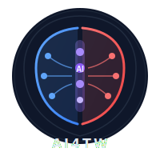

<!-- Sticky Navigation -->
<nav class="sticky-nav">
  

    <a href="#" class="nav-brand">AI for the Win</a>
    

      <a href="#labs">Labs</a>
      <a href="#paths">Learning Paths</a>
      <a href="#cost">Cost</a>
      <a href="#faq">FAQ</a>
      
        
      
      <button class="theme-toggle" onclick="toggleTheme()" title="Toggle light/dark mode">
        ☀️
      </button>
    

  

</nav>

  
  <h1>AI for the Win</h1>
  
Build AI-Powered Security Tools | Hands-On Learning

  

    

      
      
      
    

    
python labs/lab01-phishing-classifier/solution/main.py

    

    
[+] Trained on 1,000 labeled emails

    
[+] Model: Random Forest with TF-IDF features

    

    
Testing on new emails...

    
  "Dear user, your account will be suspended" → 🚨 PHISHING (94%)

    
  "Q3 revenue report attached"               → ✅ LEGIT (91%)

    
  "Coinbase: verify identity immediately"    → 🚨 PHISHING (97%)

    

    
Top phishing indicators learned:

    
  1. urgency_score  (+0.34) ← "immediately", "suspend", "verify"

    
  2. url_mismatch   (+0.28) ← display text ≠ actual link

    
  3. sender_anomaly (+0.19) ← domain doesn't match brand

  

  

    

      
30+

      
Hands-On Labs

    

    

      
839

      
Tests Passing

    

    

      
9

      
Learning Paths

    

    

      
MIT

      
Licensed

    

  

  

    <a href="https://github.com/depalmar/ai_for_the_win#get-started-in-5-minutes" class="btn btn-primary">Get Started</a>
    <a href="https://github.com/depalmar/ai_for_the_win" class="btn btn-secondary">View on GitHub</a>
  

<!-- Prerequisites Checklist -->

  <h2 class="section-title">What You Need to Start</h2>

  

    <h3>Prerequisites Checklist</h3>
    

      

        &#10003;
        

          <strong>Python 3.10+</strong>
          Any OS: Windows, macOS, Linux
        

      

      

        &#10003;
        

          <strong>Code Editor</strong>
          VS Code, Cursor, or PyCharm
        

      

      

        &#10003;
        

          <strong>8GB+ RAM</strong>
          16GB recommended for local LLMs
        

      

      

        &#10003;
        

          <strong>Git Installed</strong>
          To clone the repository
        

      

      

        &#10003;
        

          <strong>API Key (optional)</strong>
          Only needed for Labs 04+. Free options available.
        

      

      

        &#10003;
        

          <strong>Security Background</strong>
          Basic security concepts helpful but not required
        

      

    

  

  <h2 class="section-title">Why AI for the Win?</h2>

  

    

      
&#127919;

      <h3>Built for Security Practitioners</h3>
      
Not generic ML courses. Every lab solves real security problems: phishing, malware, C2 detection, incident response.

    

    

      
&#128736;

      <h3>You Build Real Tools</h3>
      
No toy examples. Build classifiers, agents, RAG systems, and detection pipelines you can actually use.

    

    

      
&#128640;

      <h3>Vibe Coding Ready</h3>
      
Designed for AI-assisted development with Cursor, Claude Code, and Copilot. Learn the modern way.

    

    

      
&#128176;

      <h3>Start Free</h3>
      
Labs 01-03 need no API key. Learn ML foundations before spending on LLM APIs. Ollama option for $0 total.

    

    

      
&#127891;

      <h3>Beginner Friendly</h3>
      
New to Python? Start at Lab 00. Security-to-AI Glossary translates ML jargon into terms you know.

    

    

      
&#128300;

      <h3>839 Tests</h3>
      
Every lab has comprehensive tests. Know your code works before deploying. 100% pass rate.

    

  

<!-- Interactive Lab Navigator -->

  <h2 class="section-title">Interactive Lab Navigator</h2>

  

    
Your Learning Journey: Click any lab to explore

    

      

        
Setup & Intro

        

          <a href="https://github.com/depalmar/ai_for_the_win/tree/main/labs/lab00-environment-setup" class="nav-lab intro" title="Lab 00: Environment Setup">00</a>
          <a href="https://github.com/depalmar/ai_for_the_win/tree/main/labs/lab00a-python-security-fundamentals" class="nav-lab intro" title="Lab 00a: Python for Security">00a</a>
          <a href="https://github.com/depalmar/ai_for_the_win/tree/main/labs/lab00b-ml-concepts-primer" class="nav-lab intro" title="Lab 00b: ML Concepts">00b</a>
          <a href="https://github.com/depalmar/ai_for_the_win/tree/main/labs/lab00c-intro-prompt-engineering" class="nav-lab intro" title="Lab 00c: Prompt Engineering">00c</a>
          <a href="https://github.com/depalmar/ai_for_the_win/tree/main/labs/lab00d-ai-in-security-operations" class="nav-lab intro" title="Lab 00d: AI in Security Ops">00d</a>
        

      

      &#8594;
      

        
ML Basics

        

          <a href="https://github.com/depalmar/ai_for_the_win/tree/main/labs/lab01-phishing-classifier" class="nav-lab ml" title="Lab 01: Phishing Classifier (~2 hrs)">01</a>
          <a href="https://github.com/depalmar/ai_for_the_win/tree/main/labs/lab02-malware-clustering" class="nav-lab ml" title="Lab 02: Malware Clustering (~2 hrs)">02</a>
          <a href="https://github.com/depalmar/ai_for_the_win/tree/main/labs/lab03-anomaly-detection" class="nav-lab ml" title="Lab 03: Anomaly Detection (~2 hrs)">03</a>
        

      

      &#8594;
      

        
LLM Basics

        

          <a href="https://github.com/depalmar/ai_for_the_win/tree/main/labs/lab04-llm-log-analysis" class="nav-lab llm" title="Lab 04: LLM Log Analysis (~3 hrs)">04</a>
          <a href="https://github.com/depalmar/ai_for_the_win/tree/main/labs/lab05-threat-intel-agent" class="nav-lab llm" title="Lab 05: Threat Intel Agent (~3 hrs)">05</a>
          <a href="https://github.com/depalmar/ai_for_the_win/tree/main/labs/lab06-security-rag" class="nav-lab llm" title="Lab 06: Security RAG (~4 hrs)">06</a>
          <a href="https://github.com/depalmar/ai_for_the_win/tree/main/labs/lab07-yara-generator" class="nav-lab llm" title="Lab 07: YARA Generator (~3 hrs)">07</a>
        

      

      &#8594;
      

        
Advanced

        

          <a href="https://github.com/depalmar/ai_for_the_win/tree/main/labs/lab08-vuln-scanner-ai" class="nav-lab advanced" title="Lab 08: Vuln Prioritizer (~4 hrs)">08</a>
          <a href="https://github.com/depalmar/ai_for_the_win/tree/main/labs/lab09-detection-pipeline" class="nav-lab advanced" title="Lab 09: Detection Pipeline (~5 hrs)">09</a>
          <a href="https://github.com/depalmar/ai_for_the_win/tree/main/labs/lab10-ir-copilot" class="nav-lab advanced" title="Lab 10: IR Copilot (~4 hrs)">10</a>
        

      

      &#8594;
      

        
Expert DFIR

        

          <a href="https://github.com/depalmar/ai_for_the_win/tree/main/labs/lab11-ransomware-detection" class="nav-lab dfir" title="Lab 11: Ransomware Detection (~5 hrs)">11</a>
          <a href="https://github.com/depalmar/ai_for_the_win/tree/main/labs/lab12-ransomware-simulation" class="nav-lab dfir" title="Lab 12: Purple Team Sim (~6 hrs)">12</a>
          <a href="https://github.com/depalmar/ai_for_the_win/tree/main/labs/lab13-memory-forensics-ai" class="nav-lab dfir" title="Lab 13: Memory Forensics (~6 hrs)">13</a>
          <a href="https://github.com/depalmar/ai_for_the_win/tree/main/labs/lab14-c2-traffic-analysis" class="nav-lab dfir" title="Lab 14: C2 Traffic Analysis (~5 hrs)">14</a>
          <a href="https://github.com/depalmar/ai_for_the_win/tree/main/labs/lab15-lateral-movement-detection" class="nav-lab dfir" title="Lab 15: Lateral Movement (~5 hrs)">15</a>
        

      

      &#8594;
      

        
Expert AI

        

          <a href="https://github.com/depalmar/ai_for_the_win/tree/main/labs/lab16-threat-actor-profiling" class="nav-lab dfir" title="Lab 16: Threat Actor Profiling (~5 hrs)">16</a>
          <a href="https://github.com/depalmar/ai_for_the_win/tree/main/labs/lab17-adversarial-ml" class="nav-lab dfir" title="Lab 17: Adversarial ML (~6 hrs)">17</a>
          <a href="https://github.com/depalmar/ai_for_the_win/tree/main/labs/lab18-fine-tuning-security" class="nav-lab dfir" title="Lab 18: Fine-Tuning (~8 hrs)">18</a>
          <a href="https://github.com/depalmar/ai_for_the_win/tree/main/labs/lab19-cloud-security-ai" class="nav-lab dfir" title="Lab 19: Cloud Security AI (~5 hrs)">19</a>
          <a href="https://github.com/depalmar/ai_for_the_win/tree/main/labs/lab20-llm-red-teaming" class="nav-lab dfir" title="Lab 20: LLM Red Teaming (~6 hrs)">20</a>
        

      

    

    

      
        &#8226; ML (No API)
        &#8226; LLM
        &#8226; Advanced
        &#8226; DFIR/Expert
      
    

  

  <h3 style="margin-top: 2rem; margin-bottom: 1rem;">All 30+ Labs (Including Bridge Labs)</h3>

  <!-- Lab Filter Tabs -->
  

    <button class="filter-btn active" data-filter="all" onclick="filterLabs('all')">All Labs</button>
    <button class="filter-btn" data-filter="ml" onclick="filterLabs('ml')">ML (No API)</button>
    <button class="filter-btn" data-filter="llm" onclick="filterLabs('llm')">LLM</button>
    <button class="filter-btn" data-filter="advanced" onclick="filterLabs('advanced')">Advanced</button>
    <button class="filter-btn" data-filter="dfir" onclick="filterLabs('dfir')">DFIR/Expert</button>
  

  

    <a href="https://github.com/depalmar/ai_for_the_win/tree/main/labs/lab00-environment-setup" class="lab-card" data-category="intro">
      

        00
        Environment Setup
      

      
Python, VS Code, virtual env, Jupyter

      

        &#128337; ~30 min
        &#9733;&#9734;&#9734; Beginner
      

    </a>
    <a href="https://github.com/depalmar/ai_for_the_win/tree/main/labs/lab00a-python-security-fundamentals" class="lab-card" data-category="intro">
      

        00a
        Python for Security
      

      
Variables, files, APIs, IOC extraction

      

        &#128337; ~2 hrs
        &#9733;&#9734;&#9734; Beginner
      

    </a>
    <a href="https://github.com/depalmar/ai_for_the_win/tree/main/labs/lab00b-ml-concepts-primer" class="lab-card" data-category="intro">
      

        00b
        ML Concepts
      

      
Supervised, unsupervised, features, metrics

      

        &#128337; ~1 hr
        &#9733;&#9734;&#9734; Beginner
      

    </a>
    <a href="https://github.com/depalmar/ai_for_the_win/tree/main/labs/lab00c-intro-prompt-engineering" class="lab-card" data-category="intro">
      

        00c
        Prompt Engineering
      

      
LLM basics, templates, free playgrounds

      

        &#128337; ~1 hr
        &#9733;&#9734;&#9734; Beginner
      

    </a>
    <a href="https://github.com/depalmar/ai_for_the_win/tree/main/labs/lab00d-ai-in-security-operations" class="lab-card" data-category="intro">
      

        00d
        AI in Security Ops
      

      
Real-world use cases, limitations, workflows

      

        &#128337; ~1 hr
        &#9733;&#9734;&#9734; Beginner
      

    </a>
    <a href="https://github.com/depalmar/ai_for_the_win/tree/main/labs/lab00e-visualization-stats" class="lab-card" data-category="intro">
      

        00e
        Visualization & Stats
      

      
Statistics, Plotly, security dashboards

      

        &#128337; ~2 hrs
        &#9733;&#9734;&#9734; Beginner
      

    </a>
    <a href="https://github.com/depalmar/ai_for_the_win/tree/main/labs/lab00f-hello-world-ml" class="lab-card" data-category="intro">
      

        00f
        Hello World ML
      

      
Your first ML model, scikit-learn basics

      

        &#128337; ~1 hr
        &#9733;&#9734;&#9734; Beginner
      

    </a>
    <a href="https://github.com/depalmar/ai_for_the_win/tree/main/labs/lab00g-working-with-apis" class="lab-card" data-category="intro">
      

        00g
        Working with APIs
      

      
HTTP basics, requests, JSON parsing

      

        &#128337; ~1 hr
        &#9733;&#9734;&#9734; Beginner
      

    </a>
    <a href="https://github.com/depalmar/ai_for_the_win/tree/main/labs/lab01-phishing-classifier" class="lab-card" data-category="ml">
      

        01
        Phishing Classifier
      

      
ML text classification, TF-IDF, Random Forest

      

        &#128337; ~2 hrs
        &#9733;&#9734;&#9734; Beginner
      

    </a>
    <a href="https://github.com/depalmar/ai_for_the_win/tree/main/labs/lab02-malware-clustering" class="lab-card" data-category="ml">
      

        02
        Malware Clustering
      

      
K-Means, DBSCAN, feature extraction

      

        &#128337; ~2 hrs
        &#9733;&#9734;&#9734; Beginner
      

    </a>
    <a href="https://github.com/depalmar/ai_for_the_win/tree/main/labs/lab03-anomaly-detection" class="lab-card" data-category="ml">
      

        03
        Anomaly Detection
      

      
Isolation Forest, statistical baselines

      

        &#128337; ~2 hrs
        &#9733;&#9734;&#9734; Beginner
      

    </a>
    <a href="https://github.com/depalmar/ai_for_the_win/tree/main/labs/lab03b-ml-vs-llm" class="lab-card" data-category="ml">
      

        03b
        ML vs LLM
      

      
When to use ML vs LLM, cost comparison

      

        &#128337; ~1 hr
        &#9733;&#9734;&#9734; Beginner
      

    </a>
    <a href="https://github.com/depalmar/ai_for_the_win/tree/main/labs/lab04-llm-log-analysis" class="lab-card" data-category="llm">
      

        04
        LLM Log Analysis
      

      
Prompt engineering, IOC extraction

      

        &#128337; ~3 hrs
        &#9733;&#9733;&#9734; Intermediate
      

    </a>
    <a href="https://github.com/depalmar/ai_for_the_win/tree/main/labs/lab05-threat-intel-agent" class="lab-card" data-category="llm">
      

        05
        Threat Intel Agent
      

      
ReAct pattern, LangChain, autonomous investigation

      

        &#128337; ~3 hrs
        &#9733;&#9733;&#9734; Intermediate
      

    </a>
    <a href="https://github.com/depalmar/ai_for_the_win/tree/main/labs/lab06-security-rag" class="lab-card" data-category="llm">
      

        06
        Security RAG
      

      
Vector embeddings, ChromaDB, doc Q&A

      

        &#128337; ~4 hrs
        &#9733;&#9733;&#9734; Intermediate
      

    </a>
    <a href="https://github.com/depalmar/ai_for_the_win/tree/main/labs/lab06a-embeddings-vectors" class="lab-card" data-category="llm">
      

        06b
        Embeddings & Vectors
      

      
Deep dive into embeddings for RAG

      

        &#128337; ~2 hrs
        &#9733;&#9733;&#9734; Intermediate
      

    </a>
    <a href="https://github.com/depalmar/ai_for_the_win/tree/main/labs/lab07-yara-generator" class="lab-card" data-category="llm">
      

        07
        YARA Generator
      

      
AI-assisted rule generation, validation

      

        &#128337; ~3 hrs
        &#9733;&#9733;&#9734; Intermediate
      

    </a>
    <a href="https://github.com/depalmar/ai_for_the_win/tree/main/labs/lab07a-binary-basics" class="lab-card" data-category="llm">
      

        07a
        Binary Basics
      

      
PE files, headers, sections for YARA

      

        &#128337; ~2 hrs
        &#9733;&#9733;&#9734; Intermediate
      

    </a>
    <a href="https://github.com/depalmar/ai_for_the_win/tree/main/labs/lab08-vuln-scanner-ai" class="lab-card" data-category="advanced">
      

        08
        Vuln Prioritizer
      

      
CVSS scoring, risk-based prioritization

      

        &#128337; ~4 hrs
        &#9733;&#9733;&#9734; Intermediate
      

    </a>
    <a href="https://github.com/depalmar/ai_for_the_win/tree/main/labs/lab09-detection-pipeline" class="lab-card" data-category="advanced">
      

        09
        Detection Pipeline
      

      
Multi-stage ML + LLM architecture

      

        &#128337; ~5 hrs
        &#9733;&#9733;&#9733; Advanced
      

    </a>
    <a href="https://github.com/depalmar/ai_for_the_win/tree/main/labs/lab10-ir-copilot" class="lab-card" data-category="advanced">
      

        10
        IR Copilot
      

      
Conversational IR assistant, playbooks

      

        &#128337; ~4 hrs
        &#9733;&#9733;&#9734; Intermediate
      

    </a>
    <a href="https://github.com/depalmar/ai_for_the_win/tree/main/labs/lab10a-dfir-fundamentals" class="lab-card" data-category="dfir">
      

        10b
        DFIR Fundamentals
      

      
IR lifecycle, Windows artifacts, ATT&CK

      

        &#128337; ~2 hrs
        &#9733;&#9733;&#9734; Intermediate
      

    </a>
    <a href="https://github.com/depalmar/ai_for_the_win/tree/main/labs/lab11-ransomware-detection" class="lab-card" data-category="dfir">
      

        11
        Ransomware Detection
      

      
Entropy analysis, behavioral detection

      

        &#128337; ~5 hrs
        &#9733;&#9733;&#9733; Advanced
      

    </a>
    <a href="https://github.com/depalmar/ai_for_the_win/tree/main/labs/lab12-ransomware-simulation" class="lab-card" data-category="dfir">
      

        12
        Purple Team Sim
      

      
Safe adversary emulation, gap analysis

      

        &#128337; ~6 hrs
        &#9733;&#9733;&#9733; Advanced
      

    </a>
    <a href="https://github.com/depalmar/ai_for_the_win/tree/main/labs/lab13-memory-forensics-ai" class="lab-card" data-category="dfir">
      

        13
        Memory Forensics AI
      

      
Volatility3, process injection, credentials

      

        &#128337; ~6 hrs
        &#9733;&#9733;&#9733; Advanced
      

    </a>
    <a href="https://github.com/depalmar/ai_for_the_win/tree/main/labs/lab14-c2-traffic-analysis" class="lab-card" data-category="dfir">
      

        14
        C2 Traffic Analysis
      

      
Beaconing, DNS tunneling, JA3

      

        &#128337; ~5 hrs
        &#9733;&#9733;&#9733; Advanced
      

    </a>
    <a href="https://github.com/depalmar/ai_for_the_win/tree/main/labs/lab15-lateral-movement-detection" class="lab-card" data-category="dfir">
      

        15
        Lateral Movement
      

      
Auth anomalies, attack path graphs

      

        &#128337; ~5 hrs
        &#9733;&#9733;&#9733; Advanced
      

    </a>
    <a href="https://github.com/depalmar/ai_for_the_win/tree/main/labs/lab16-threat-actor-profiling" class="lab-card" data-category="dfir">
      

        16
        Threat Actor Profiling
      

      
TTP extraction, campaign clustering

      

        &#128337; ~5 hrs
        &#9733;&#9733;&#9733; Advanced
      

    </a>
    <a href="https://github.com/depalmar/ai_for_the_win/tree/main/labs/lab17-adversarial-ml" class="lab-card" data-category="dfir">
      

        17
        Adversarial ML
      

      
Evasion attacks, poisoning, defenses

      

        &#128337; ~6 hrs
        &#9733;&#9733;&#9733; Advanced
      

    </a>
    <a href="https://github.com/depalmar/ai_for_the_win/tree/main/labs/lab17a-ml-security-intro" class="lab-card" data-category="dfir">
      

        17a
        ML Security Intro
      

      
ML threat models, attack taxonomy

      

        &#128337; ~1 hr
        &#9733;&#9733;&#9734; Intermediate
      

    </a>
    <a href="https://github.com/depalmar/ai_for_the_win/tree/main/labs/lab18-fine-tuning-security" class="lab-card" data-category="dfir">
      

        18
        Fine-Tuning
      

      
Custom embeddings, LoRA, deployment

      

        &#128337; ~8 hrs
        &#9733;&#9733;&#9733; Expert
      

    </a>
    <a href="https://github.com/depalmar/ai_for_the_win/tree/main/labs/lab19a-cloud-security-fundamentals" class="lab-card" data-category="dfir">
      

        19a
        Cloud Security Basics
      

      
AWS/Azure/GCP fundamentals, IAM, logs

      

        &#128337; ~2 hrs
        &#9733;&#9733;&#9734; Intermediate
      

    </a>
    <a href="https://github.com/depalmar/ai_for_the_win/tree/main/labs/lab19-cloud-security-ai" class="lab-card" data-category="dfir">
      

        19
        Cloud Security AI
      

      
AI-powered CloudTrail analysis

      

        &#128337; ~5 hrs
        &#9733;&#9733;&#9733; Advanced
      

    </a>
    <a href="https://github.com/depalmar/ai_for_the_win/tree/main/labs/lab20-llm-red-teaming" class="lab-card" data-category="dfir">
      

        20
        LLM Red Teaming
      

      
Prompt injection, jailbreaks, guardrails

      

        &#128337; ~6 hrs
        &#9733;&#9733;&#9733; Advanced
      

    </a>
  

  

    <a href="https://github.com/depalmar/ai_for_the_win#get-started-in-5-minutes" class="btn btn-primary">Get Started</a>
    <a href="https://github.com/depalmar/ai_for_the_win/tree/main/labs" class="btn btn-secondary">Browse All Labs</a>
  

  <h2 class="section-title">Choose Your Learning Path</h2>
  
Click to expand each path and see the recommended labs

  

    

      

        <h3>🟢 Beginner</h3>
        &#9660;
      

      

        
Start here! Foundations → ML basics → LLM basics. No API key needed until Lab 04.

        
📚 Foundations (Optional Prep)

        

          

            00
            Environment Setup
            ~30 min
          

          

            00a
            Python for Security
            ~2 hrs
          

          

            00b
            ML Concepts Primer
            ~1 hr
          

          

            00c
            Prompt Engineering
            ~1 hr
          

          

            00d
            AI in Security Ops
            ~1 hr
          

        

        
🔬 ML Basics (No API Key)

        

          

            01
            Phishing Classifier
            ~2 hrs
          

          

            02
            Malware Clustering
            ~2 hrs
          

          

            03
            Anomaly Detection
            ~2 hrs
          

        

        
🤖 LLM Basics (API Key Required)

        

          

            04
            LLM Log Analysis
            ~3 hrs
          

          

            05
            Threat Intel Agent
            ~3 hrs
          

          

            06
            Security RAG
            ~4 hrs
          

          

            07
            YARA Generator
            ~3 hrs
          

        

        
Total: ~25 hours | Cost: Free → ~$5

      

    

    

      

        <h3>🟡 Intermediate</h3>
        &#9660;
      

      

        
Build advanced tools. Detection pipelines, IR copilots, and DFIR automation.

        

          

            08
            Vuln Prioritizer
            ~4 hrs
          

          

            09
            Detection Pipeline
            ~5 hrs
          

          

            10
            IR Copilot
            ~4 hrs
          

          

            11
            Ransomware Detection
            ~5 hrs
          

          

            12
            Purple Team Sim
            ~6 hrs
          

          

            13
            Memory Forensics
            ~6 hrs
          

          

            14
            C2 Traffic Analysis
            ~5 hrs
          

          

            15
            Lateral Movement
            ~5 hrs
          

        

        
Total: ~40 hours | Cost: ~$15-25

      

    

    

      

        <h3>🔴 Expert</h3>
        &#9660;
      

      

        
Advanced techniques: threat actor profiling, adversarial ML, fine-tuning, and red teaming.

        

          

            16
            Threat Actor Profiling
            ~5 hrs
          

          

            17
            Adversarial ML
            ~6 hrs
          

          

            18
            Fine-Tuning
            ~8 hrs
          

          

            19
            Cloud Security AI
            ~5 hrs
          

          

            20
            LLM Red Teaming
            ~6 hrs
          

        

        
Total: ~30 hours | Cost: ~$10-20

      

    

  

  <h3 style="margin-top: 2.5rem; margin-bottom: 1rem;">By Role</h3>
  

    <a href="https://github.com/depalmar/ai_for_the_win/blob/main/resources/role-based-learning-paths.md#-soc-analyst-path" class="feature" style="text-decoration: none; cursor: pointer;">
      
🔵

      <h3 style="margin: 0;">SOC Analyst</h3>
      
Automate triage, reduce alert fatigue

      Labs 00→04→06→10
    </a>
    <a href="https://github.com/depalmar/ai_for_the_win/blob/main/resources/role-based-learning-paths.md#-threat-hunter-path" class="feature" style="text-decoration: none; cursor: pointer;">
      
🟢

      <h3 style="margin: 0;">Threat Hunter</h3>
      
Find unknowns, detect anomalies

      Labs 03→02→14→15
    </a>
    <a href="https://github.com/depalmar/ai_for_the_win/blob/main/resources/role-based-learning-paths.md#-detection-engineer-path" class="feature" style="text-decoration: none; cursor: pointer;">
      
🟡

      <h3 style="margin: 0;">Detection Engineer</h3>
      
ML-powered rules, fewer false positives

      Labs 01→03→07→09
    </a>
    <a href="https://github.com/depalmar/ai_for_the_win/blob/main/resources/role-based-learning-paths.md#-red-team-path" class="feature" style="text-decoration: none; cursor: pointer;">
      
🔴

      <h3 style="margin: 0;">AI Red Team</h3>
      
Evade ML, attack AI systems

      Labs 03→17→20
    </a>
  

  

    <a href="https://github.com/depalmar/ai_for_the_win/blob/main/resources/role-based-learning-paths.md" class="btn btn-secondary">View All 9 Role Paths</a>
  

  <h2 class="section-title">Cost Breakdown</h2>

  <table class="cost-table">
    <thead>
      <tr>
        <th>Labs</th>
        <th>API Required</th>
        <th>Estimated Cost</th>
      </tr>
    </thead>
    <tbody>
      <tr>
        <td>00-03 (ML Foundations)</td>
        <td>No</td>
        <td class="free">Free</td>
      </tr>
      <tr>
        <td>04-07 (LLM Basics)</td>
        <td>Yes</td>
        <td>~$2-8</td>
      </tr>
      <tr>
        <td>08-10 (Advanced)</td>
        <td>Yes</td>
        <td>~$5-15</td>
      </tr>
      <tr>
        <td>11-20 (Expert)</td>
        <td>Yes</td>
        <td>~$10-25</td>
      </tr>
      <tr>
        <td><strong>With Ollama (local)</strong></td>
        <td>No</td>
        <td class="free">$0 Total</td>
      </tr>
    </tbody>
  </table>

  

    <a href="https://github.com/depalmar/ai_for_the_win/blob/main/docs/guides/api-keys-guide.md" class="btn btn-secondary">API Keys Setup Guide</a>
  

  <h2 class="section-title">Quick Start</h2>

  

    <h3 style="margin-top: 0; color: var(--secondary);">🚀 Option 1: Zero Setup (Colab)</h3>
    
Run labs directly in your browser — no installation needed!

    

      
      
    

    
📓 <a href="https://github.com/depalmar/ai_for_the_win/tree/main/notebooks" style="color: var(--primary);">All 23 lab notebooks</a> available for Colab

  

  

    <h3 style="margin-top: 0; color: var(--secondary);">💻 Option 2: Local Setup</h3>
<pre><code># Clone and setup
git clone https://github.com/depalmar/ai_for_the_win.git
cd ai_for_the_win
python -m venv venv
source venv/bin/activate  # Win: venv\Scripts\activate
pip install -r requirements.txt

# Run Lab 01 (no API key needed!)

python labs/lab01-phishing-classifier/solution/main.py</code></pre>

  

  

    <a href="https://github.com/depalmar/ai_for_the_win#get-started-in-5-minutes" class="btn btn-primary">Full Setup Instructions</a>
    <a href="https://github.com/depalmar/ai_for_the_win/tree/main/notebooks" class="btn btn-secondary">Browse All Notebooks</a>
  

  <h2 class="section-title">Frequently Asked Questions</h2>
  

    

      
Do I need prior ML/AI experience?

      
No. Labs 00a-00c cover Python basics, ML concepts, and prompt engineering from scratch. The Security-to-AI Glossary translates ML jargon into security terms you already know.

    

    

      
Which LLM provider should I use?

      
We recommend Anthropic Claude for best reasoning on security tasks. But all labs support OpenAI GPT-4, Google Gemini, and Ollama (free, local). You only need one.

    

    

      
Can I run everything locally without API costs?

      
Yes! Use Ollama to run models locally for free. Labs 01-03 don't need any API at all. You can complete the entire course for $0 if you use local models.

    

    

      
How long does it take to complete all labs?

      
The full course is approximately 40-89 hours depending on AI assistance level. With AI coding tools, most labs take 50-70% less time. Focus on your role's learning path first (~5-18 hours) for immediate value.

    

    

      
What if I get stuck on a lab?

      
Every lab includes complete solution code, step-by-step hints, and a Colab notebook you can run in your browser. Check GitHub Discussions for community help or open an issue.

    

    

      
Are the labs production-ready?

      
The solutions demonstrate core concepts. For production use, you'd add error handling, logging, and scale considerations. Lab 09 (Detection Pipeline) shows production architecture patterns.

    

    

      
How is this different from other ML courses?

      
Every lab solves a real security problem. You won't build iris classifiers or digit recognizers. You'll build phishing detectors, threat intel agents, and ransomware analyzers.

    

  

  <h2 class="section-title">Resources</h2>

  

    

      
&#128218;

      <h3><a href="https://github.com/depalmar/ai_for_the_win/blob/main/resources/security-to-ai-glossary.md">Security-to-AI Glossary</a></h3>
      
ML terms explained using security analogies

    

    

      
&#128506;

      <h3><a href="https://github.com/depalmar/ai_for_the_win/blob/main/resources/role-based-learning-paths.md">Learning Paths</a></h3>
      
Curated paths for 9 security roles

    

    

      
&#128273;

      <h3><a href="https://github.com/depalmar/ai_for_the_win/blob/main/docs/guides/api-keys-guide.md">API Keys Guide</a></h3>
      
Setup and cost management

    

    

      
&#128211;

      <h3><a href="https://github.com/depalmar/ai_for_the_win/blob/main/docs/guides/jupyter-basics-guide.md">Jupyter Basics</a></h3>
      
Local notebook setup guide

    

    

      
☁️

      <h3></h3>
      
Zero-setup browser notebooks

    

  

  <a href="https://github.com/depalmar/ai_for_the_win#get-started-in-5-minutes" class="btn btn-primary">Get Started</a>
  <a href="https://github.com/depalmar/ai_for_the_win" class="btn btn-secondary">Star on GitHub</a>

  <a href="https://github.com/depalmar/ai_for_the_win">GitHub</a>
  <a href="https://github.com/depalmar/ai_for_the_win/discussions">Discussions</a>
  <a href="https://github.com/depalmar/ai_for_the_win/issues">Issues</a>
  <a href="https://github.com/depalmar/ai_for_the_win/releases">Releases</a>

  MIT License | Built for security practitioners | Created by <a href="https://www.linkedin.com/in/raymond-depalma" style="color: var(--text-muted); text-decoration: underline;">Raymond DePalma</a>

  <em>Disclaimer: This is a personal educational project created on personal time. It is not affiliated with, endorsed by, or sponsored by any employer or vendor. All tool references are for educational purposes only.</em>

