# Lab 05: Build a Threat Intelligence AI Agent

**Difficulty:** 🟡 Intermediate | **Time:** 60-90 min | **Prerequisites:** Lab 04, API key

Create an AI agent that gathers, correlates, and reports on threat intelligence.

---

## 🎯 Learning Objectives

By completing this lab, you will:

1. Understand AI agent architecture (ReAct pattern)
2. Build tools for the agent to use
3. Implement memory and context management
4. Create a multi-step reasoning agent
5. Integrate with threat intelligence sources

---

## ⏱️ Estimated Time

90-120 minutes (with AI assistance)

---

## 📋 Prerequisites

- Completed Labs 01-04
- Anthropic or OpenAI API key
- Basic understanding of threat intelligence concepts

### Required Libraries

```bash
pip install langchain langchain-anthropic langgraph python-dotenv requests rich
```

### Recommended Reading

This lab uses LangChain and LangGraph. If you're new to these frameworks:

| Resource | What You'll Learn | When to Read |
|----------|-------------------|--------------|
| [LangChain Guide](../../docs/guides/langchain-guide.md) | Chains, prompts, agents basics | Before starting |
| [Security Fundamentals](../../docs/guides/security-fundamentals-for-beginners.md) | IOCs, threat intel concepts | If new to security |

> 💡 **Quick Context**: LangChain is a framework for building LLM applications. LangGraph adds stateful workflows. This lab teaches you to combine them into an autonomous threat intel agent.

---

## 📖 Background

### What is an AI Agent?

An AI agent is an LLM that can:

1. **Reason** about a task
2. **Plan** steps to accomplish it
3. **Use tools** to gather information
4. **Iterate** until the task is complete

### The ReAct Pattern

**Re**asoning + **Act**ing = ReAct


**ASCII fallback:**

```
Think: What do I need to do?
Act: Use a tool to get information
Observe: What did I learn?
Think: What should I do next?
... repeat until done ...
Answer: Final response
```

### Agent Architecture

```mermaid
flowchart TB
    subgraph Agent["🤖 AI AGENT"]
        direction TB

        subgraph Core["Core Components"]
            LLM["🧠 LLM<br/>(Brain)"]
            Memory["💾 Memory<br/>(Context)"]
        end

        subgraph Tools["🔧 Tools"]
            IP["IP Lookup"]
            Domain["Domain Analysis"]
            Hash["Hash Check"]
            CVE["CVE Search"]
            MITRE["MITRE ATT&CK"]
        end

        Executor["⚡ Executor"]
    end

    Query[/"User Query"/] --> LLM
    LLM <--> Memory
    LLM --> Executor
    Executor --> IP
    Executor --> Domain
    Executor --> Hash
    Executor --> CVE
    Executor --> MITRE

    IP --> Results[/"Tool Results"/]
    Domain --> Results
    Hash --> Results
    CVE --> Results
    MITRE --> Results

    Results --> LLM
    LLM --> Response[/"Final Response"/]

    style Agent fill:#1a1a2e,stroke:#4a90d9,stroke-width:2px
    style Core fill:#16213e,stroke:#4a90d9
    style Tools fill:#16213e,stroke:#4a90d9
    style LLM fill:#4a90d9,stroke:#fff
    style Executor fill:#e94560,stroke:#fff
```



**ASCII fallback (for non-Mermaid viewers):**

```
┌─────────────────────────────────────────────────────┐
│                    AI AGENT                          │
├─────────────────────────────────────────────────────┤
│  ┌─────────┐  ┌─────────┐  ┌─────────────────────┐  │
│  │  LLM    │  │ Memory  │  │      Tools          │  │
│  │ (Brain) │  │(Context)│  │                     │  │
│  └────┬────┘  └────┬────┘  │ • IP Lookup         │  │
│       │            │       │ • Domain Analysis   │  │
│       └──────┬─────┘       │ • Hash Check        │  │
│              │             │ • CVE Search        │  │
│              ▼             │ • MITRE ATT&CK      │  │
│       ┌──────────┐         └─────────────────────┘  │
│       │ Executor │──────────────────────────────────│
│       └──────────┘                                  │
└─────────────────────────────────────────────────────┘
```

### ⚠️ Agent Hallucination Risks

Agents can make multi-step mistakes that compound:

| Risk | Example | Mitigation |
|------|---------|------------|
| **Invented IOCs** | Agent "finds" IPs not in tool results | Validate all IOCs against tool output |
| **Wrong tool calls** | Agent calls wrong tool with wrong args | Add input validation to tools |
| **Confident misattribution** | "This is APT29" with no evidence | Require tool-sourced evidence |
| **Infinite loops** | Agent keeps retrying failed actions | Set max iterations |

**Key principle:** Tools return facts. Agent interprets them. Verify interpretations match tool data.

> 📖 See [Security Prompts Template](../../templates/prompts/security_prompts.md) for anti-hallucination prompt patterns.

---

## 🔬 Lab Tasks

### Task 1: Create Agent Tools (25 min)

Build tools the agent can use for threat intelligence:

```python
# Tool 1: IP Reputation Lookup
def lookup_ip(ip: str) -> dict:
    """
    Look up reputation and geolocation for an IP address.

    Uses: AbuseIPDB, VirusTotal, or simulated data

    Returns:
        {
            "ip": "1.2.3.4",
            "is_malicious": True/False,
            "abuse_score": 0-100,
            "country": "RU",
            "asn": "AS12345",
            "threat_types": ["C2", "Botnet"],
            "last_seen": "2024-01-15"
        }
    """
    pass

# Tool 2: Domain Analysis
def analyze_domain(domain: str) -> dict:
    """
    Analyze a domain for threat indicators.

    Returns:
        {
            "domain": "evil.com",
            "is_malicious": True/False,
            "category": "malware/phishing/c2",
            "first_seen": "2024-01-01",
            "dns_records": {...},
            "ssl_info": {...},
            "whois": {...}
        }
    """
    pass

# Tool 3: Hash Lookup
def check_hash(file_hash: str) -> dict:
    """
    Check file hash against threat intelligence.

    Returns:
        {
            "hash": "abc123...",
            "hash_type": "sha256",
            "is_malicious": True/False,
            "malware_family": "Emotet",
            "detection_ratio": "45/72",
            "first_seen": "2024-01-10"
        }
    """
    pass

# Tool 4: CVE Lookup
def search_cve(cve_id: str) -> dict:
    """
    Get details about a CVE.

    Returns:
        {
            "cve_id": "CVE-2024-1234",
            "description": "...",
            "cvss_score": 9.8,
            "severity": "CRITICAL",
            "affected_products": [...],
            "exploited_in_wild": True/False,
            "patch_available": True/False
        }
    """
    pass

# Tool 5: MITRE ATT&CK Lookup
def get_attack_technique(technique_id: str) -> dict:
    """
    Get details about a MITRE ATT&CK technique.

    Returns:
        {
            "technique_id": "T1059.001",
            "name": "PowerShell",
            "tactic": "Execution",
            "description": "...",
            "detection": "...",
            "mitigations": [...],
            "related_groups": [...]
        }
    """
    pass
```

### Task 2: Define Tool Schemas (10 min)

Create proper tool definitions for the agent:

```python
from langchain.tools import StructuredTool
from pydantic import BaseModel, Field

class IPLookupInput(BaseModel):
    ip: str = Field(description="IPv4 or IPv6 address to look up")

class DomainInput(BaseModel):
    domain: str = Field(description="Domain name to analyze")

# TODO: Create StructuredTool for each function
ip_tool = StructuredTool.from_function(
    func=lookup_ip,
    name="ip_lookup",
    description="Look up threat intelligence for an IP address",
    args_schema=IPLookupInput
)
```

### Task 3: Build the Agent (25 min)

Create the threat intelligence agent:

```python
class ThreatIntelAgent:
    """
    AI agent for threat intelligence gathering and analysis.

    TODO:
    1. Initialize with LLM and tools
    2. Implement ReAct reasoning loop
    3. Add memory for conversation context
    4. Handle tool errors gracefully
    """

    def __init__(self, llm, tools: list):
        self.llm = llm
        self.tools = {t.name: t for t in tools}
        self.memory = []
        self.system_prompt = """You are a threat intelligence analyst agent.

Your job is to:
1. Investigate indicators of compromise (IOCs)
2. Gather context from multiple sources
3. Correlate findings
4. Assess threat severity
5. Provide actionable intelligence

You have access to these tools:
{tools}

For each task:
1. Think about what information you need
2. Use appropriate tools to gather data
3. Analyze and correlate findings
4. Provide a comprehensive assessment

Always cite your sources and confidence levels."""

    def run(self, query: str) -> str:
        """
        Run the agent on a query.

        TODO:
        1. Add query to memory
        2. Start reasoning loop
        3. Parse LLM response for tool calls
        4. Execute tools and feed results back
        5. Continue until agent provides final answer
        """
        pass

    def _parse_tool_call(self, response: str) -> tuple:
        """Parse tool name and arguments from LLM response."""
        pass

    def _execute_tool(self, tool_name: str, args: dict) -> str:
        """Execute a tool and return results."""
        pass
```

### Task 4: Implement Memory (15 min)

Add conversation memory for context:

```python
class AgentMemory:
    """
    Memory system for the agent.

    TODO:
    1. Store conversation history
    2. Store investigation findings
    3. Track IOCs already investigated
    4. Implement context window management
    """

    def __init__(self, max_history: int = 10):
        self.conversation = []
        self.findings = {}
        self.investigated_iocs = set()

    def add_message(self, role: str, content: str):
        """Add a message to conversation history."""
        pass

    def add_finding(self, ioc: str, data: dict):
        """Store investigation finding."""
        pass

    def get_context(self) -> str:
        """Get formatted context for LLM."""
        pass

    def is_investigated(self, ioc: str) -> bool:
        """Check if IOC was already investigated."""
        pass
```

### Task 5: Create Investigation Workflow (20 min)

Build a complete investigation workflow:

```python
def investigate_incident(agent: ThreatIntelAgent, iocs: dict) -> str:
    """
    Investigate an incident given a set of IOCs.

    Args:
        agent: Configured ThreatIntelAgent
        iocs: Dict with ips, domains, hashes, etc.

    Returns:
        Complete investigation report

    TODO:
    1. Investigate each IOC
    2. Correlate findings
    3. Identify attack patterns
    4. Map to MITRE ATT&CK
    5. Generate threat assessment
    6. Provide recommendations
    """

    investigation_prompt = f"""
    Investigate this security incident. Here are the IOCs found:

    IPs: {iocs.get('ips', [])}
    Domains: {iocs.get('domains', [])}
    Hashes: {iocs.get('hashes', [])}

    For each IOC:
    1. Look up threat intelligence
    2. Determine if malicious
    3. Find connections between IOCs

    Then:
    1. Identify the likely attack type
    2. Map to MITRE ATT&CK techniques
    3. Assess overall severity
    4. Recommend response actions

    Provide a comprehensive threat intelligence report.
    """

    return agent.run(investigation_prompt)
```

### Task 6: Add Report Generation (15 min)

Generate professional reports:

```python
def generate_threat_report(
    agent: ThreatIntelAgent,
    findings: dict,
    format: str = "markdown"
) -> str:
    """
    Generate a threat intelligence report.

    TODO:
    1. Format findings into report structure
    2. Add executive summary
    3. Include IOC table
    4. Add MITRE ATT&CK mapping
    5. Include recommendations
    6. Add confidence levels
    """
    pass
```

---

## 📁 Files

```
lab05-threat-intel-agent/
├── README.md
├── starter/
│   ├── main.py
│   ├── tools.py
│   ├── agent.py
│   └── memory.py
├── solution/
│   ├── main.py
│   ├── tools.py
│   ├── agent.py
│   └── memory.py
├── data/
│   └── mock_intel.json    # Simulated TI data
└── tests/
    └── test_agent.py
```

---

## 🧪 Test Scenarios

### Scenario 1: Single IP Investigation

```python
result = agent.run("Investigate this IP: 185.143.223.47")
```

**Expected behavior:**

1. Agent looks up IP reputation
2. Finds it's associated with C2 servers
3. Provides geolocation and ASN info
4. Recommends blocking

### Scenario 2: Multi-IOC Investigation

```python
iocs = {
    "ips": ["185.143.223.47", "91.234.99.100"],
    "domains": ["evil-c2.com", "malware-drop.net"],
    "hashes": ["a1b2c3d4e5f6..."]
}
result = investigate_incident(agent, iocs)
```

**Expected behavior:**

1. Agent investigates each IOC
2. Correlates findings (e.g., domain resolves to IP)
3. Identifies attack pattern
4. Maps to ATT&CK techniques
5. Generates comprehensive report

### Scenario 3: CVE Research

```python
result = agent.run("""
We found CVE-2024-1234 being exploited in our network.
Provide a complete threat assessment and remediation plan.
""")
```

---

## ✅ Success Criteria

- [ ] All 5 tools implemented and working
- [ ] Agent can reason about tasks
- [ ] Agent correctly uses tools based on query
- [ ] Memory persists across turns
- [ ] Multi-IOC investigations complete successfully
- [ ] Reports are clear and actionable
- [ ] Error handling is robust

---

## 🚀 Bonus Challenges

1. **Live API Integration**: Connect to real TI sources (VirusTotal, AbuseIPDB)
2. **Caching**: Add Redis caching for API responses
3. **Parallel Lookups**: Investigate multiple IOCs simultaneously
4. **STIX Output**: Generate STIX 2.1 formatted intelligence
5. **Alerting**: Add Slack/Teams notifications for critical findings
6. **Web UI**: Build a Streamlit dashboard for the agent

---

## 💡 Implementation Tips

### Tool Design

```python
# Good tool: Clear, focused, returns structured data
def lookup_ip(ip: str) -> dict:
    """Returns structured threat intel for an IP."""
    return {"ip": ip, "is_malicious": True, ...}

# Bad tool: Too broad, unclear output
def analyze(thing: str) -> str:
    """Analyzes something and returns info."""
    return "some text"
```

### Agent Prompt Engineering

```python
SYSTEM_PROMPT = """You are a threat intelligence analyst.

IMPORTANT RULES:
1. Always use tools to gather information - don't make assumptions
2. Cite confidence levels: HIGH (API confirmed), MEDIUM (correlated), LOW (inferred)
3. If a tool returns no data, say so - don't fabricate
4. Always provide actionable recommendations

TOOL USAGE:
- To look up an IP: Use ip_lookup tool
- To analyze a domain: Use domain_analysis tool
- For file hashes: Use hash_check tool
- For CVEs: Use cve_lookup tool
- For ATT&CK: Use mitre_lookup tool

OUTPUT FORMAT:
Think: [your reasoning]
Action: [tool_name]
Action Input: [tool arguments as JSON]
Observation: [tool result - I will provide this]
... repeat as needed ...
Final Answer: [your complete response]
"""
```

### Error Handling

```python
def _execute_tool(self, tool_name: str, args: dict) -> str:
    try:
        tool = self.tools.get(tool_name)
        if not tool:
            return f"Error: Unknown tool '{tool_name}'"

        result = tool.invoke(args)
        return json.dumps(result, indent=2)

    except Exception as e:
        return f"Error executing {tool_name}: {str(e)}"
```

---

## 📚 Resources

- [LangChain Agents](https://python.langchain.com/docs/modules/agents/)
- [LangGraph](https://python.langchain.com/docs/langgraph)
- [ReAct Paper](https://arxiv.org/abs/2210.03629)
- [VirusTotal API](https://developers.virustotal.com/)
- [MITRE ATT&CK API](https://attack.mitre.org/resources/working-with-attack/)

---

> **Stuck?** See the [Lab 05 Walkthrough](../../docs/walkthroughs/lab05-threat-intel-agent-walkthrough.md) for step-by-step guidance.

**Next Lab**: [Lab 06 - RAG for Security Docs](../lab06-security-rag/)
